

<picture>
  <source media="(prefers-color-scheme: dark)" srcset="assets/brand/melaya_horizontal_dark.webp">
  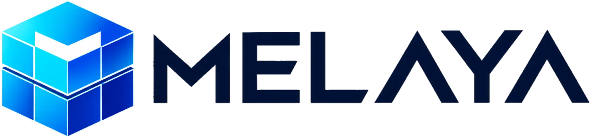
</picture>

### Governed AI agents that actually do the work

Melaya is a governed platform for AI agents that do real work — in the cloud or on your own machine — across your business systems, your browser, and real mobile apps.

[**Website**](https://melaya.org) · [**Documentation**](https://melaya.org/documentation) · [**MCP Server**](https://melaya.org/en/product/mcp) · [**Discord**](https://discord.gg/2BBMUUdnkj)

> This public repository contains the **official SDKs and public developer documentation**. The hosted platform, agent runtime, Device Control service and Browser Control service are proprietary and are not included here.
>
> Looking for the **remote MCP server**? It lives at **[melaya-labs/melaya-mcp](https://github.com/melaya-labs/melaya-mcp)** — one endpoint, `https://api.melaya.org/mcp`.

---

## The products

<table>
<tr>
<td width="60" align="center"></td>
<td><b>Melaya Agents</b> — <i>available now</i> A visual builder for high-trust AI workflows: tools, models, memory, subagents, knowledge, evaluations, schedules, cost limits and human approvals, composed as a pipeline. <a href="https://melaya.org/en/product/agentic-framework">Product</a> · <a href="./docs/agent-builder.md">Docs</a></td>
</tr>
<tr>
<td align="center">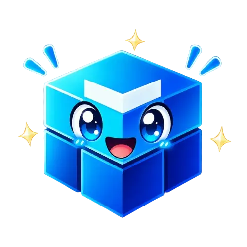</td>
<td><b>Melaya Assistant</b> — <i>available now</i> Work across your approved business systems in natural language, with permissions, execution and approvals still under your control. <a href="https://melaya.org/en/product/assistant">Product</a></td>
</tr>
<tr>
<td align="center"></td>
<td><b>Device Control</b> — <i>flagship, available now</i> Let an AI operate real Android apps the way a person does: tapping, typing, swiping and navigating through the visible interface. No vendor API, no integration. Per-app permissions and approval before sensitive actions. <a href="https://melaya.org/en/product/agentic-device-control">Product</a> · <a href="./docs/device-control.md">Docs</a></td>
</tr>
<tr>
<td align="center"></td>
<td><b>Browser Control</b> — <i>available now</i> The same governed execution in real browser tabs, with live visibility and a human stop control. Ships as a browser extension for Chrome, Edge, Brave, Opera and Firefox. <a href="https://melaya.org/en/product/agentic-browser-control">Product</a> · <a href="https://addons.mozilla.org/en-US/firefox/addon/melaya/">Firefox add-on</a></td>
</tr>
<tr>
<td align="center"></td>
<td><b>MCP Server</b> — <i>available now</i> Give Claude, Codex, Cursor, ChatGPT or any compatible client access to Melaya's execution layer through <b>one remote endpoint</b>. 80 scoped tools across 8 permission domains, OAuth 2.1 + PKCE, no API key to paste. <a href="https://melaya.org/en/product/mcp">Product</a> · <a href="https://github.com/melaya-labs/melaya-mcp">Repo</a> · <a href="./docs/mcp.md">Docs</a></td>
</tr>
<tr>
<td align="center"></td>
<td><b>Melaya Marketing</b> — <i>available now</i> One AI-native marketing cockpit. Connects your ads, search consoles, analytics, DNS and site, reads your <i>real</i> numbers server-side, and runs actions that do the work — SEO and page-speed audits, DNS hardening, wasted-spend cleanup — pausing for your approval before anything touches real money or your live site. <a href="https://melaya.org">Product</a></td>
</tr>
</table>

## The catalog

| | | |
|:--:|:--:|:--:|
| **6,912** | **103** | **26** |
| scoped tools | specialized subagents | AI providers |
| **80** | **9** | **8** |
| MCP tools | official SDKs | MCP permission domains |

Runtime catalog endpoints remain the source of truth; the numbers above move as the catalog grows.

## Bring your own model

Cloud or local, per agent. Your credentials stay in encrypted Connectors, never in prompts or pipeline JSON.

&nbsp;&nbsp;
&nbsp;&nbsp;
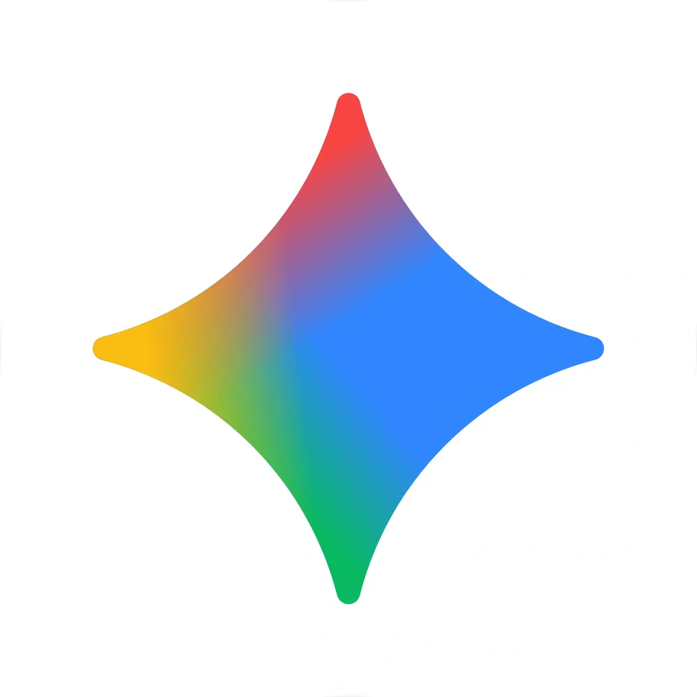&nbsp;&nbsp;
&nbsp;&nbsp;
&nbsp;&nbsp;
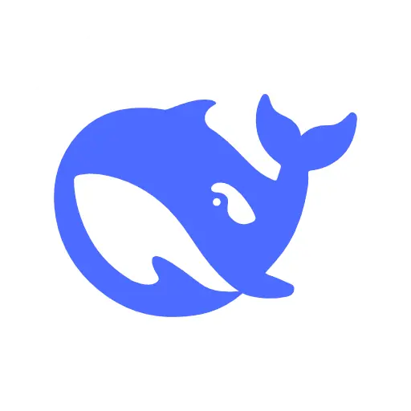&nbsp;&nbsp;
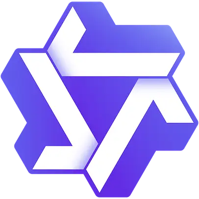&nbsp;&nbsp;
&nbsp;&nbsp;
&nbsp;&nbsp;
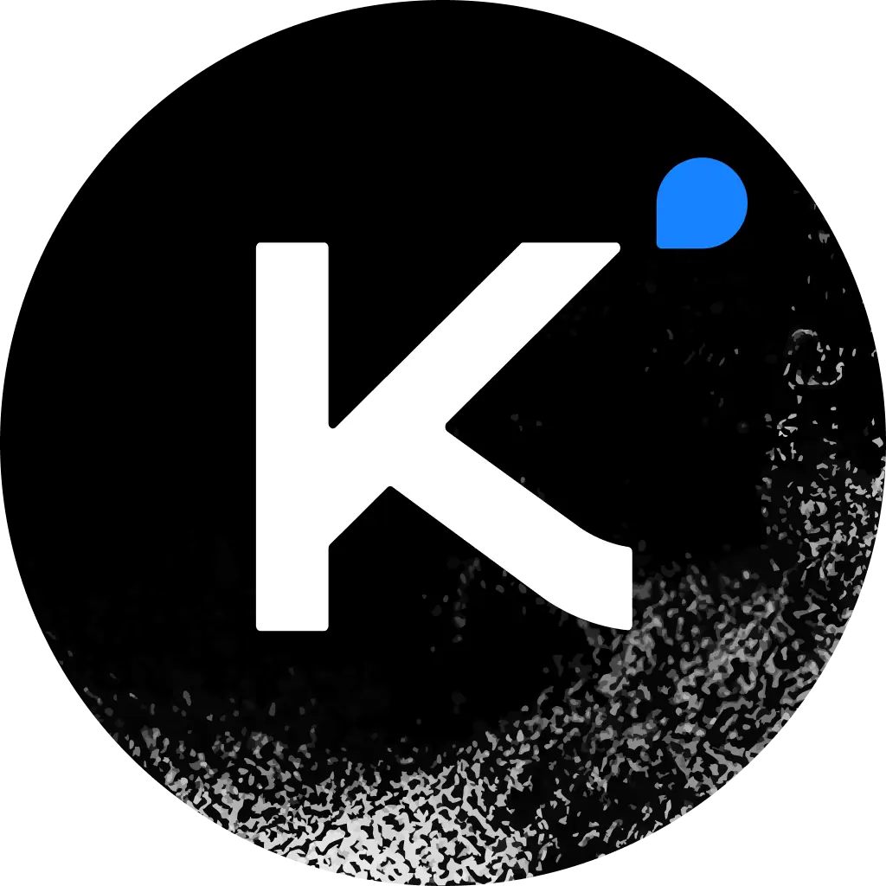&nbsp;&nbsp;
&nbsp;&nbsp;
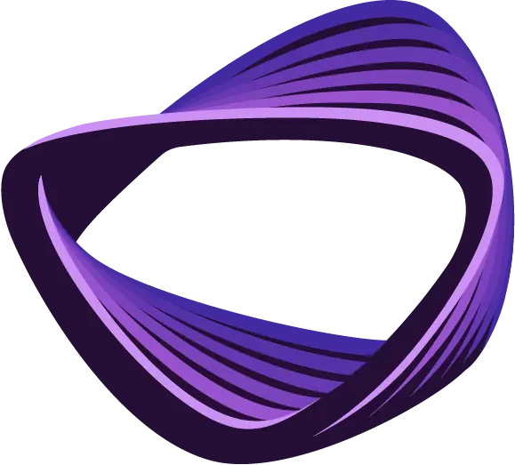&nbsp;&nbsp;
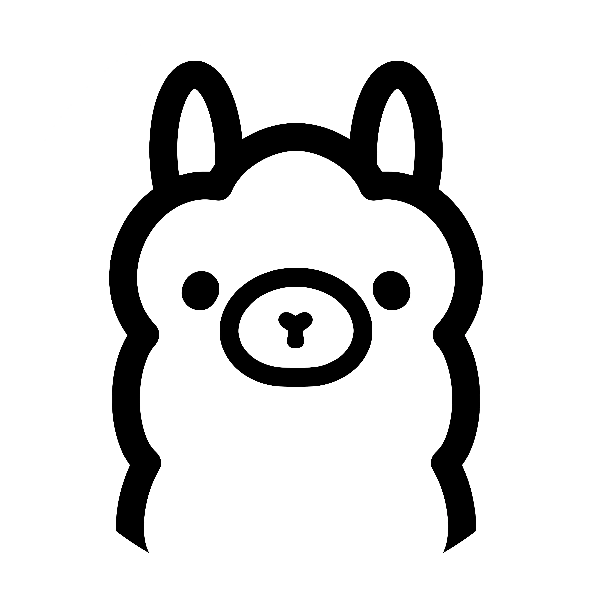&nbsp;&nbsp;
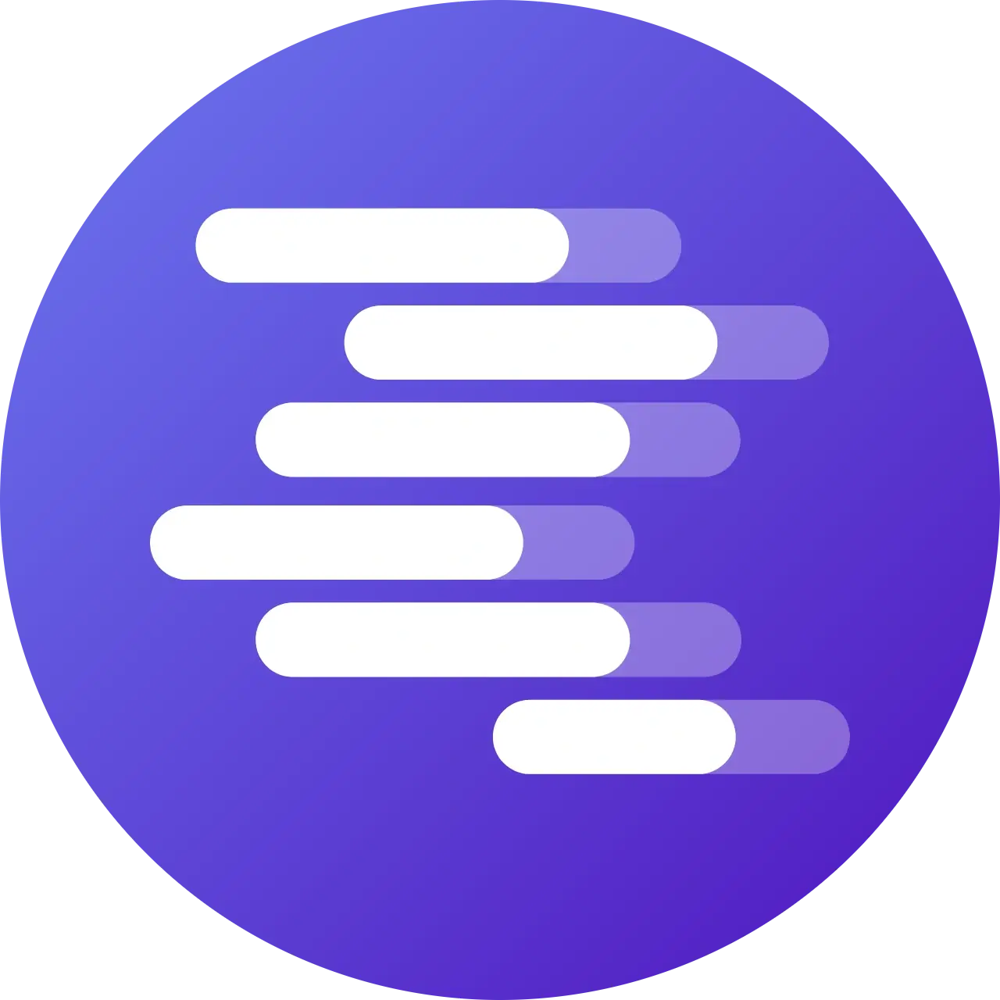

Local models through Ollama and LM Studio run on a user-controlled runner, so the data never leaves the machine.

## Why teams use Melaya

- Minimum-tool agent permissions instead of an unlimited toolbox
- Encrypted Connectors instead of credentials in prompts or pipeline JSON
- Tenant-scoped projects and API keys
- Human approval for consequential actions, enforced server-side
- Run status, traces, costs, evaluations, outputs and cancellation
- Cloud execution or a user-controlled local runner
- Mobile and browser workflows for products that expose no suitable API
- Nine official SDKs over the same public lifecycle

## Quick start: pair a phone

~~~ts
import { Melaya } from "@melaya/sdk";

const melaya = new Melaya({
  apiKey: process.env.MELAYA_API_KEY!
});

const { code, expiresInSeconds } =
  await melaya.agents.phone.pair();

console.log({ code, expiresInSeconds });

const devices = await melaya.agents.phone.listDevices();
const apps = await melaya.agents.phone.listApps();

await melaya.agents.phone.setAllowedApps([
  "com.android.chrome"
]);
~~~

A Melaya platform key is required. "No app API required" means Device Control operates the target app through its user interface; it does not mean the Melaya SDK is unauthenticated.

## Quick start: connect over MCP

No SDK, no key to paste. Add the endpoint to any compatible client and approve the scopes you want:

~~~bash
claude mcp add --transport http melaya https://api.melaya.org/mcp
# or
codex mcp add melaya --url https://api.melaya.org/mcp
~~~

Setup for Claude, ChatGPT, Cursor, VS Code, Le Chat, Gemini CLI, Zed, Cline, Goose and more: **[melaya-labs/melaya-mcp](https://github.com/melaya-labs/melaya-mcp)**.

## Official SDKs

| | Language | Package |
|:--:|---|---|
| 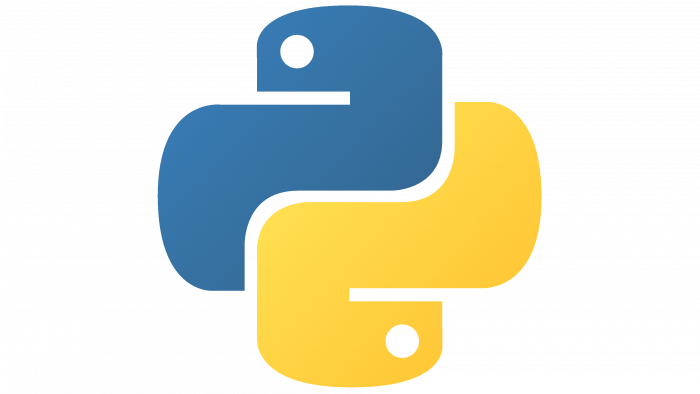 | Python | [melaya](./packages/sdk-python) |
| | TypeScript / JavaScript | [@melaya/sdk](./packages/sdk) |
|  | Go | [melaya-go](./packages/sdk-go) |
|  | Rust | [melaya](./packages/sdk-rust) |
| 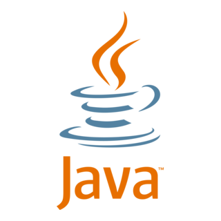 | Java | [org.melaya:melaya-sdk](./packages/sdk-java) |
| 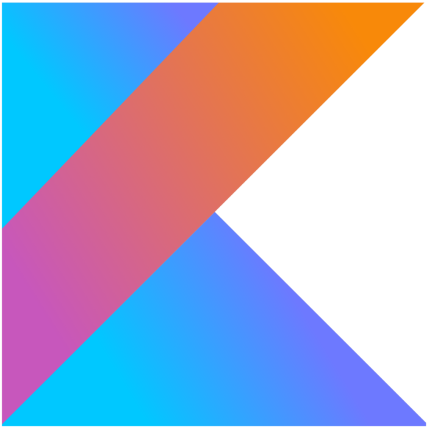 | Kotlin | [org.melaya:melaya-sdk-kotlin](./packages/sdk-kotlin) |
| 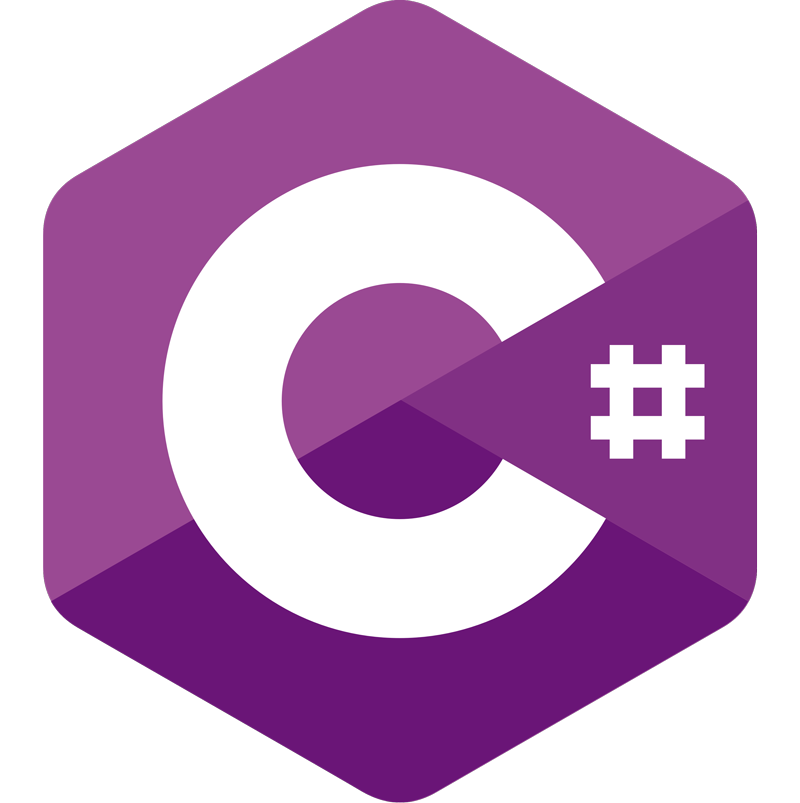 | C# / .NET | [Melaya.SDK](./packages/sdk-csharp) |
| 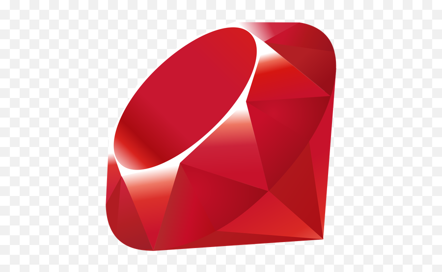 | Ruby | [melaya](./packages/sdk-ruby) |
|  | PHP | [melaya/sdk](./packages/sdk-php) |

The supported public surface includes authentication, projects, Connectors, credentials, pipelines, templates, Agent Builder tools, Device Control management, HITL, evaluations, events, billing, account operations, runner management, team management, MFA, the assistant, bug reports and the memory graph.

Internal operator APIs are intentionally absent.

## Security rules for SDK users

- Keep **MELAYA_API_KEY** in a secret manager or server environment.
- Store model and external-service credentials in Connectors.
- Do not put secrets in source, prompts, RAG documents, artifacts, or **env_overrides**.
- Give agents the smallest practical tool and app allowlists.
- Require human approval for consequential writes.
- Validate errors and final state before reporting success.
- Revoke unused platform keys and paired devices.
- Redact credentials from proxy, APM, and WebSocket query logs.

See [Security and trust](./docs/security.md).

## Documentation

- [Melaya Agents](./docs/agent-builder.md)
- [Device Control](./docs/device-control.md)
- [MCP Server](./docs/mcp.md)
- [Concepts](./docs/concepts.md)
- [Security and trust](./docs/security.md)
- [FAQ](./docs/faq.md)
- [Comparison](./docs/comparison.md)

Full product documentation and interactive API reference: [melaya.org/documentation](https://melaya.org/documentation).

## License

The SDK code and public documentation are licensed under [Apache-2.0](./LICENSE). The hosted platform and engines are proprietary and are not included in this repository.

Third-party names and logos are used only for identification and do not imply endorsement.

 
 
<b>Melaya Labs</b> · <a href="https://melaya.org">melaya.org</a> · <a href="https://discord.gg/2BBMUUdnkj">Discord</a>

