<div align="center">

<picture>
  <source media="(prefers-color-scheme: dark)" srcset="assets/brand/melaya_horizontal_dark.webp">
  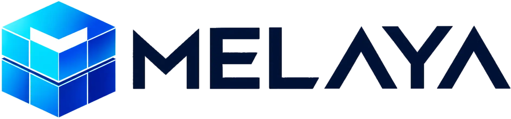
</picture>

### Governed AI agents that actually do the work

Melaya is a governed platform for AI agents that do real work — in the cloud or on your own machine — across your business systems, your browser, and real mobile apps.

[**Website**](https://melaya.org) · [**Documentation**](https://melaya.org/documentation) · [**MCP Server**](https://melaya.org/en/product/mcp) · [**Agent Skill**](#agent-skill-teach-any-ai-to-run-melaya) · [**Discord**](https://discord.gg/2BBMUUdnkj)

[](#official-sdks)
[](#the-catalog)
[](#the-catalog)
[](#bring-your-own-model)
[](https://github.com/melaya-labs/melaya-mcp)
[](./skills/melaya)
[](./LICENSE)

</div>

> This public repository contains the **official SDKs and public developer documentation**. The hosted platform, agent runtime, Device Control service and Browser Control service are proprietary and are not included here.
>
> Looking for the **remote MCP server**? It lives at **[melaya-labs/melaya-mcp](https://github.com/melaya-labs/melaya-mcp)** — one endpoint, `https://api.melaya.org/mcp`.

---

## The products

<table>
<tr>
<td width="60" align="center">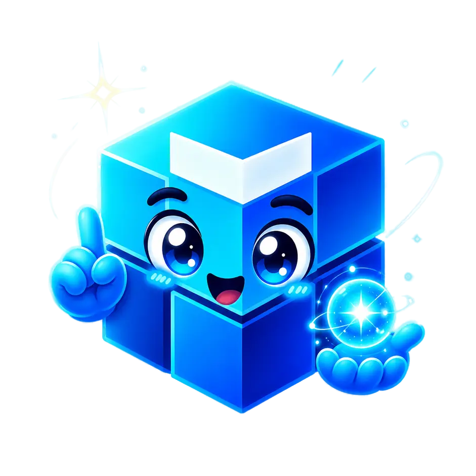</td>
<td><b>Melaya Agents</b> — <i>available now</i><br>A visual builder for high-trust AI workflows: tools, models, memory, subagents, knowledge, evaluations, schedules, cost limits and human approvals, composed as a pipeline.<br><a href="https://melaya.org/en/product/agentic-framework">Melaya Agents product page</a> · <a href="./docs/agent-builder.md">Docs</a></td>
</tr>
<tr>
<td align="center">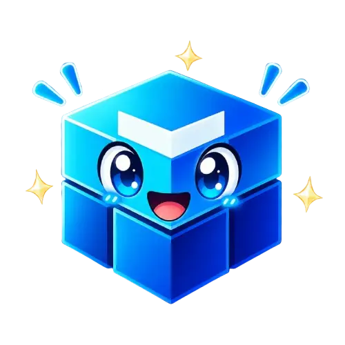</td>
<td><b>Melaya Assistant</b> — <i>available now</i><br>Work across your approved business systems in natural language, with permissions, execution and approvals still under your control.<br><a href="https://melaya.org/en/product/assistant">Melaya Assistant product page</a></td>
</tr>
<tr>
<td align="center">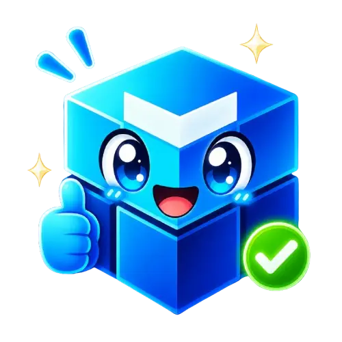</td>
<td><b>Device Control</b> — <i>flagship, available now</i><br>Let an AI operate real Android apps the way a person does: tapping, typing, swiping and navigating through the visible interface. No vendor API, no integration. Per-app permissions and approval before sensitive actions.<br><a href="https://melaya.org/en/product/agentic-device-control">Device Control product page</a> · <a href="./docs/device-control.md">Docs</a></td>
</tr>
<tr>
<td align="center"></td>
<td><b>Browser Control</b> — <i>available now</i><br>The same governed execution in real browser tabs, with live visibility and a human stop control. Ships as a browser extension for Chrome, Edge, Brave, Opera and Firefox.<br><a href="https://melaya.org/en/product/agentic-browser-control">Browser Control product page</a> · <a href="https://addons.mozilla.org/en-US/firefox/addon/melaya/">Firefox add-on</a></td>
</tr>
<tr>
<td align="center">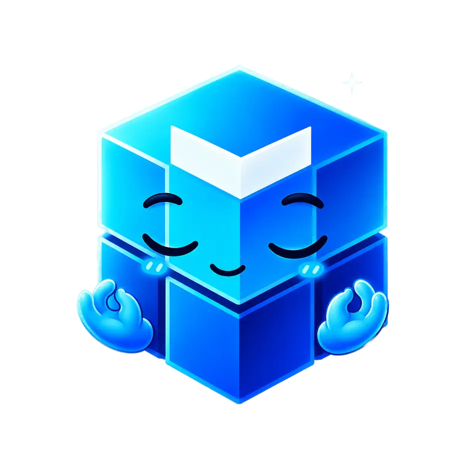</td>
<td><b>MCP Server</b> — <i>available now</i><br>Give Claude, Codex, Cursor, ChatGPT or any compatible client access to Melaya's execution layer through <b>one remote endpoint</b>. 88 scoped tools across 9 permission domains, OAuth 2.1 + PKCE, no API key to paste.<br><a href="https://melaya.org/en/product/mcp">MCP Server product page</a> · <a href="https://github.com/melaya-labs/melaya-mcp">Repo</a> · <a href="./docs/mcp.md">Docs</a> · <a href="./skills/melaya">Agent Skill</a></td>
</tr>
<tr>
<td align="center">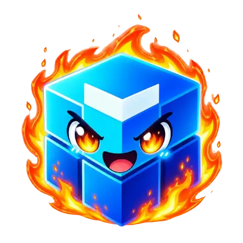</td>
<td><b>Melaya Marketing</b> — <i>available now</i><br>One AI-native marketing cockpit. Connects your ads, search consoles, analytics, DNS and site, reads your <i>real</i> numbers server-side, and runs actions that do the work — SEO and page-speed audits, DNS hardening, wasted-spend cleanup — pausing for your approval before anything touches real money or your live site.<br><a href="https://melaya.org/en/product/marketing">Melaya Marketing product page</a></td>
</tr>
</table>

## The catalog

<div align="center">

| | | |
|:--:|:--:|:--:|
| **8,222** | **103** | **48** |
| scoped tools | specialized subagents | AI providers |
| **88** | **9** | **9** |
| MCP tools | official SDKs | MCP permission domains |

</div>

Runtime catalog endpoints remain the source of truth; the numbers above move as the catalog grows.

## Bring your own model

48 providers, chosen per agent. Credentials stay in encrypted Connectors, never in prompts or pipeline JSON.

### Local and self-hosted

Models on your own machine or your own server, reached through the Melaya runner. The data never leaves your network.

<table>
<tr><td align="center" width="25%"><br><sub>Ollama</sub></td><td align="center" width="25%">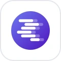<br><sub>LM Studio</sub></td><td align="center" width="25%">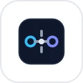<br><sub>OpenAI-Compatible</sub></td><td align="center" width="25%"><br><sub>LiteLLM Proxy</sub></td></tr>
</table>

### CLIs on your runner

Use the AI subscription you already pay for: the runner drives the official command-line tool on your machine.

<table>
<tr><td align="center" width="33%"><br><sub>Claude Code</sub></td><td align="center" width="33%">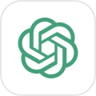<br><sub>Codex</sub></td><td align="center" width="33%"><br><sub>GitHub Copilot</sub></td></tr>
</table>

### Cloud

Frontier labs, open-model hosts and gateways. Bring your key, or use Melaya AI with no key at all.

<table>
<tr><td align="center" width="16%">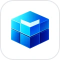<br><sub>Melaya AI</sub></td><td align="center" width="16%">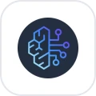<br><sub>Amazon Bedrock</sub></td><td align="center" width="16%"><br><sub>Anthropic</sub></td><td align="center" width="16%"><br><sub>Avis</sub></td><td align="center" width="16%">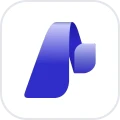<br><sub>Azure AI Foundry</sub></td><td align="center" width="16%">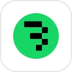<br><sub>Baseten</sub></td></tr>
<tr><td align="center" width="16%">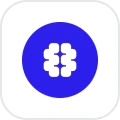<br><sub>Braintrust AI Gateway</sub></td><td align="center" width="16%"><br><sub>Cerebras</sub></td><td align="center" width="16%"><br><sub>Chutes</sub></td><td align="center" width="16%">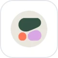<br><sub>Cohere</sub></td><td align="center" width="16%">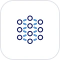<br><sub>DeepInfra</sub></td><td align="center" width="16%">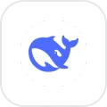<br><sub>DeepSeek</sub></td></tr>
<tr><td align="center" width="16%">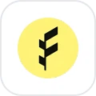<br><sub>Featherless</sub></td><td align="center" width="16%"><br><sub>Fireworks AI</sub></td><td align="center" width="16%">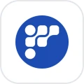<br><sub>FriendliAI</sub></td><td align="center" width="16%"><br><sub>Gonka</sub></td><td align="center" width="16%"><br><sub>Google Gemini</sub></td><td align="center" width="16%"><br><sub>Grok (xAI)</sub></td></tr>
<tr><td align="center" width="16%"><br><sub>Groq</sub></td><td align="center" width="16%"><br><sub>Hugging Face</sub></td><td align="center" width="16%"><br><sub>MiniMax</sub></td><td align="center" width="16%"><br><sub>Mistral AI</sub></td><td align="center" width="16%"><br><sub>ModelRush</sub></td><td align="center" width="16%">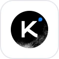<br><sub>Moonshot</sub></td></tr>
<tr><td align="center" width="16%"><br><sub>Nebius Token Factory</sub></td><td align="center" width="16%">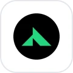<br><sub>Novita AI</sub></td><td align="center" width="16%">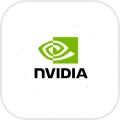<br><sub>NVIDIA NIM</sub></td><td align="center" width="16%">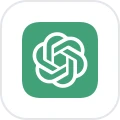<br><sub>OpenAI</sub></td><td align="center" width="16%"><br><sub>OpenRouter</sub></td><td align="center" width="16%">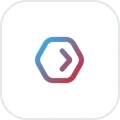<br><sub>Portkey</sub></td></tr>
<tr><td align="center" width="16%">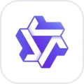<br><sub>Qwen (Alibaba)</sub></td><td align="center" width="16%"><br><sub>Reka AI</sub></td><td align="center" width="16%">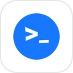<br><sub>Requesty</sub></td><td align="center" width="16%">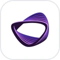<br><sub>SambaNova</sub></td><td align="center" width="16%"><br><sub>Scaleway Generative APIs</sub></td><td align="center" width="16%">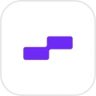<br><sub>SiliconFlow</sub></td></tr>
<tr><td align="center" width="16%">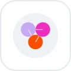<br><sub>Together AI</sub></td><td align="center" width="16%"><br><sub>Upstage Solar</sub></td><td align="center" width="16%">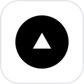<br><sub>Vercel AI Gateway</sub></td><td align="center" width="16%">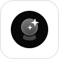<br><sub>Writingmate</sub></td><td align="center" width="16%"><br><sub>Zhipu AI</sub></td></tr>
</table>

## Why teams use Melaya

- Minimum-tool agent permissions instead of an unlimited toolbox
- Encrypted Connectors instead of credentials in prompts or pipeline JSON
- Tenant-scoped projects and API keys
- Human approval for consequential actions, enforced server-side
- Run status, traces, costs, evaluations, outputs and cancellation
- Cloud execution or a user-controlled local runner
- Mobile and browser workflows for products that expose no suitable API
- Nine official SDKs over the same public lifecycle

## Quick start: pair a phone

~~~ts
import { Melaya } from "@melaya/sdk";

const melaya = new Melaya({
  apiKey: process.env.MELAYA_API_KEY!
});

const { code, expiresInSeconds } =
  await melaya.agents.phone.pair();

console.log({ code, expiresInSeconds });

const devices = await melaya.agents.phone.listDevices();
const apps = await melaya.agents.phone.listApps();

await melaya.agents.phone.setAllowedApps([
  "com.android.chrome"
]);
~~~

A Melaya platform key is required. "No app API required" means Device Control operates the target app through its user interface; it does not mean the Melaya SDK is unauthenticated.

## Quick start: connect over MCP

No SDK, no key to paste. Add the endpoint to any compatible client and approve the scopes you want:

~~~bash
claude mcp add --transport http melaya https://api.melaya.org/mcp
# or
codex mcp add melaya --url https://api.melaya.org/mcp
~~~

Setup for Claude, ChatGPT, Cursor, VS Code, Le Chat, Gemini CLI, Zed, Cline, Goose and more: **[melaya-labs/melaya-mcp](https://github.com/melaya-labs/melaya-mcp)**.

## Agent Skill: teach any AI to run Melaya

The MCP server gives your assistant the tools. The **[Melaya skill](./skills/melaya)** gives it the method: connecting services, building and validating pipelines on real runs, triggers and approvals, reading results and handing work over. A free, open playbook your assistant reads before it acts, so it gets things right the first time.

**Any assistant** (ChatGPT, Gemini, Cursor, …): paste this line.

```text
Install the Melaya skill from https://github.com/melaya-labs/melaya/tree/main/skills/melaya and use it whenever I ask you to work with Melaya.
```

**Claude Code**: copy it into your skills folder, then restart. It loads on its own when you mention Melaya.

```bash
git clone --depth 1 https://github.com/melaya-labs/melaya /tmp/melaya && cp -r /tmp/melaya/skills/melaya ~/.claude/skills/
```

**Claude.ai and Claude Desktop**: download [`skills/melaya`](./skills/melaya) as a .zip and upload it under **Settings → Capabilities → Skills**. Anywhere else, add [`SKILL.md`](./skills/melaya/SKILL.md) as a project instruction or rules file.

The skill is one short router with the rules that always apply, plus eleven modules the assistant opens only when the task needs them:

<table>
<tr><td width="50%" valign="top"><a href="./skills/melaya/modules/quickstart"><b>quickstart</b></a><br><sub>Plain-language journeys for non-technical users</sub></td><td width="50%" valign="top"><a href="./skills/melaya/modules/discovery"><b>discovery</b></a><br><sub>Finding the right tools, templates and connected services</sub></td></tr>
<tr><td width="50%" valign="top"><a href="./skills/melaya/modules/runners-models"><b>runners-models</b></a><br><sub>The runner and models: Claude Code, Codex, Copilot, Ollama, LM Studio, cloud</sub></td><td width="50%" valign="top"><a href="./skills/melaya/modules/projects-templates"><b>projects-templates</b></a><br><sub>Projects, teams and starting from a validated template</sub></td></tr>
<tr><td width="50%" valign="top"><a href="./skills/melaya/modules/pipeline-authoring"><b>pipeline-authoring</b></a><br><sub>Pipeline configs that generate and run correctly</sub></td><td width="50%" valign="top"><a href="./skills/melaya/modules/agentic-systems"><b>agentic-systems</b></a><br><sub>Complete multi-pipeline systems, designed end to end</sub></td></tr>
<tr><td width="50%" valign="top"><a href="./skills/melaya/modules/data-spine"><b>data-spine</b></a><br><sub>Google Sheets data stores, bulk scoring, clean records</sub></td><td width="50%" valign="top"><a href="./skills/melaya/modules/automation-governance"><b>automation-governance</b></a><br><sub>Schedules, event triggers, approvals and cost limits</sub></td></tr>
<tr><td width="50%" valign="top"><a href="./skills/melaya/modules/validate-debug"><b>validate-debug</b></a><br><sub>Proving a pipeline on real runs and fixing what fails</sub></td><td width="50%" valign="top"><a href="./skills/melaya/modules/client-handover"><b>client-handover</b></a><br><sub>Documentation and handover for the people who will use it</sub></td></tr>
<tr><td width="50%" valign="top"><a href="./skills/melaya/modules/devices-browser"><b>devices-browser</b></a><br><sub>Agents that use a phone or a browser like a person</sub></td><td width="50%"></td></tr>
</table>

## Official SDKs

<div align="center">

| | Language | Package |
|:--:|---|---|
| 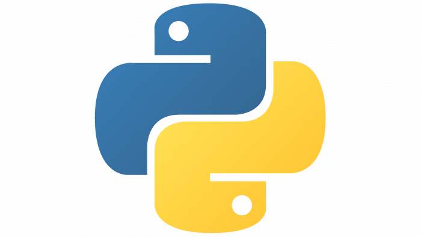 | Python | [melaya](./packages/sdk-python) |
| | TypeScript / JavaScript | [@melaya/sdk](./packages/sdk) |
|  | Go | [melaya-go](./packages/sdk-go) |
| 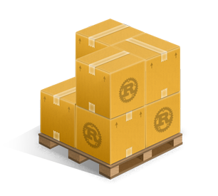 | Rust | [melaya](./packages/sdk-rust) |
| 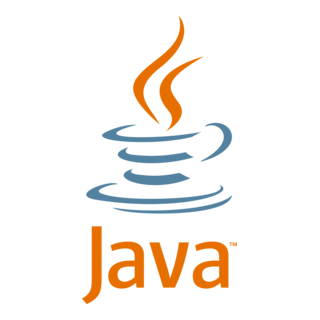 | Java | [org.melaya:melaya-sdk](./packages/sdk-java) |
| 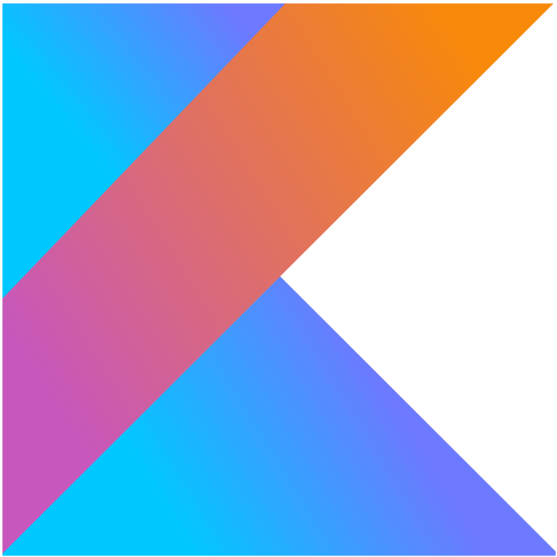 | Kotlin | [org.melaya:melaya-sdk-kotlin](./packages/sdk-kotlin) |
| 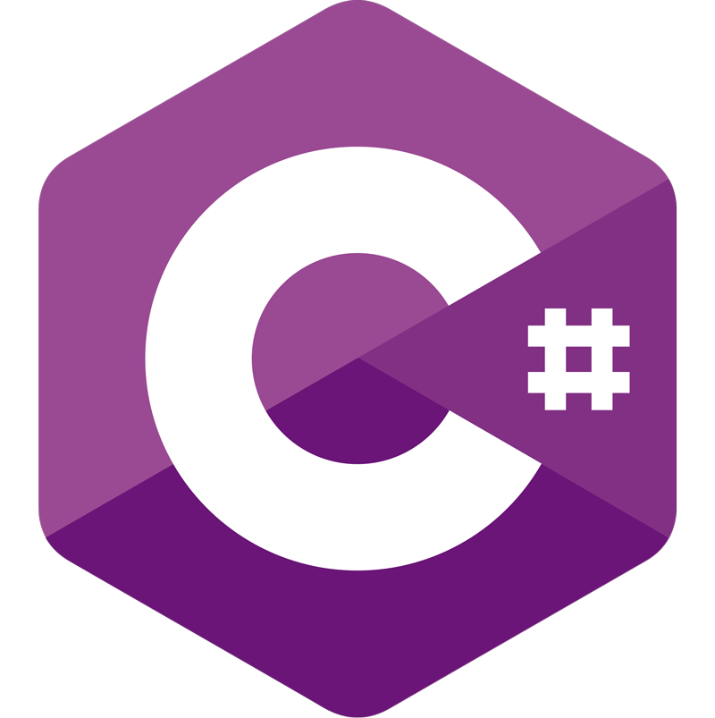 | C# / .NET | [Melaya.SDK](./packages/sdk-csharp) |
| 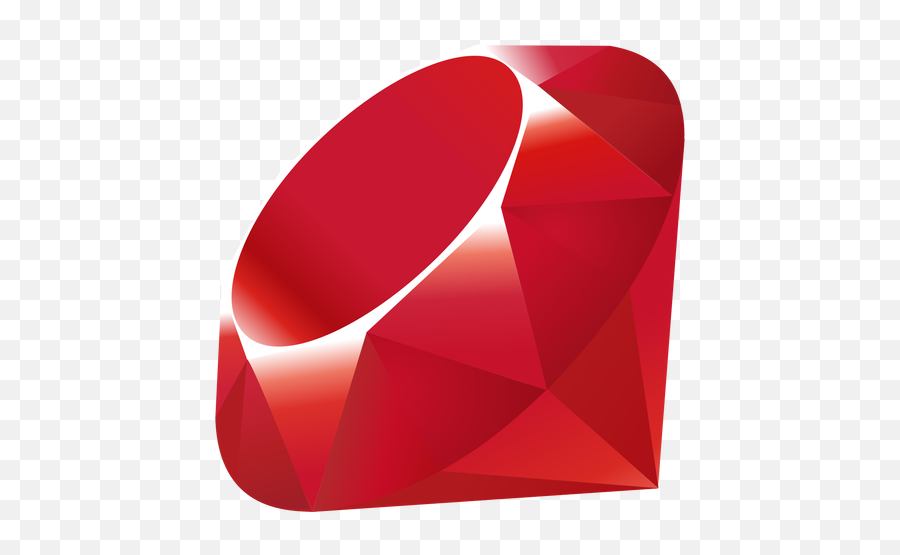 | Ruby | [melaya](./packages/sdk-ruby) |
|  | PHP | [melaya/sdk](./packages/sdk-php) |

</div>

The supported public surface includes authentication, projects, Connectors (personal and project-shared), credentials, connector tool calls (discover and call the tools your connected services unlock, with an in-app approval for writes), pipelines with run inputs and file uploads, pipeline documents (static context and RAG), templates, Agent Builder tools, the tool-call audit log, Device Control management, HITL, evaluations, events, billing, account operations, runner management, team management, MFA, the assistant, bug reports and agent memory.

What the SDKs drive: [Melaya Agents](https://melaya.org/en/product/agentic-framework) pipelines and runs, the [Melaya Assistant](https://melaya.org/en/product/assistant), [Device Control](https://melaya.org/en/product/agentic-device-control) on real Android apps, [Browser Control](https://melaya.org/en/product/agentic-browser-control), and the same execution layer behind the [MCP Server](https://melaya.org/en/product/mcp) and [Melaya Marketing](https://melaya.org/en/product/marketing).

Internal operator APIs are intentionally absent.

## Security rules for SDK users

- Keep **MELAYA_API_KEY** in a secret manager or server environment.
- Store model and external-service credentials in Connectors.
- Do not put secrets in source, prompts, RAG documents, artifacts, or **env_overrides**.
- Give agents the smallest practical tool and app allowlists.
- Require human approval for consequential writes.
- Validate errors and final state before reporting success.
- Revoke unused platform keys and paired devices.
- Redact credentials from proxy, APM, and WebSocket query logs.

See [Security and trust](./docs/security.md).

## Documentation

- [Melaya Agents](./docs/agent-builder.md)
- [Device Control](./docs/device-control.md)
- [MCP Server](./docs/mcp.md)
- [Agent Skill](./skills/melaya)
- [Concepts](./docs/concepts.md)
- [Security and trust](./docs/security.md)
- [FAQ](./docs/faq.md)
- [Comparison](./docs/comparison.md)

Full product documentation and interactive API reference: [melaya.org/documentation](https://melaya.org/documentation).

## Where to find us

Melaya is listed across the MCP registries and the product directories below.
Every link was fetched and confirmed live on 2026-09-21.

**Product directories**

[](https://www.producthunt.com/products/melaya)
[](https://alternativeto.net/software/melaya/about/)
[](https://www.saashub.com/melaya)
[](https://sourceforge.net/software/product/Melaya/)
[](https://slashdot.org/software/p/Melaya/)
[](https://www.indiehackers.com/product/melaya)

**AI agent directories**

[](https://aiagentsdirectory.com/agent/melaya)
[](https://agentlocker.ai/agent/melaya)
[](https://aitoolseekers.com/tools/melaya)

**MCP ecosystem**

[](https://registry.modelcontextprotocol.io)
[](https://glama.ai/mcp/servers/@melaya-labs/melaya-mcp)
[](https://mcp.so/servers/melaya-1f614a)
[](https://smithery.ai/servers/info-h530/melaya)
[](https://mcpserver.dev/s/melaya_1f0eb4j)
[](https://mcpmarket.com/server/melaya)
[](https://cursor.directory/plugins/melaya)

<sub>Also on <a href="https://launchkiwi.com/p/melaya">LaunchKiwi</a> · <a href="https://makerhunt.io/project/melaya">MakerHunt</a> · <a href="https://launchnest.io/p/melaya">LaunchNest</a> · <a href="https://www.foundrlist.com/product/melaya">FoundrList</a> · <a href="https://launchpadly.co/startup/melaya">Launchpadly</a> · <a href="https://launchigniter.com/product/melaya">LaunchIgniter</a> · <a href="https://tools.launchllama.co/products/melaya">Launch Llama</a> · <a href="https://thesaasdir.com/product/melaya/">The SaaS Dir</a> · <a href="https://getprojectradar.com/notes/melaya">ProjectRadar</a> · <a href="https://topbusinesssoftware.com/products/Melaya/reviews/">TopBusinessSoftware</a> · <a href="https://hackernoon.com/u/melaya">HackerNoon</a></sub>

## License

The SDK code and public documentation are licensed under [Apache-2.0](./LICENSE). The hosted platform and engines are proprietary and are not included in this repository.

Third-party names and logos are used only for identification and do not imply endorsement.

<div align="center">
<br>
<br>
<sub><b>Melaya Labs</b> · <a href="https://melaya.org">melaya.org</a> · <a href="https://discord.gg/2BBMUUdnkj">Discord</a></sub>
</div>
