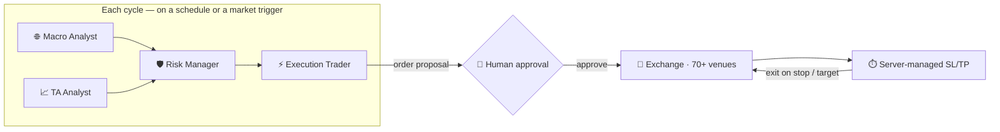

# AI agentic trading

**AI agentic trading** on Melaya means autonomous, multi-agent **trading crews** — teams of specialized AI agents that research the market, find setups, size risk, and execute orders, with a human in the loop on every trade and trading-desk safety rails throughout. It is the flagship of the Melaya [agentic orchestration platform](./concepts.md), wired directly into the [unified engine across 70+ venues](./exchanges.md).

This page describes the capability at a product level. The strategy logic, agent prompts, and engine internals are proprietary and not published here.

## What a trading crew is

A trading crew is a **pipeline of specialized AI personas**, each with its own scoped toolkit, model, and job — instead of one over-loaded "trading bot" prompt. A typical crew:

Melaya ships **seven trading personas** — you pick which seats to fill, the model behind each, and the data each one reads:

- **Macro Analyst** — labels the regime (RISK_ON, RISK_OFF, CHOP, VOL_EXPANSION) against rates, DXY, equities, and on-chain flows.
- **TA Analyst** — ranks directional setups by edge, with a confidence interval, from price/volume, funding, OI, and liquidations.
- **Quant Analyst** — systematic signals and cross-venue structure.
- **Sentiment Analyst** — news, social, and narrative flow.
- **Risk Manager** — **holds the veto** (an explicit kill word blocks the trade) and sizes the notional.
- **Portfolio Manager** — exposure and correlation across the book.
- **Execution Trader** — the **only** seat allowed to place orders; translates the approved plan into exact exchange calls and stops the instant you reject.

Run any subset, in **sequence or in parallel** (a common pattern: Macro ∥ TA → Risk → Execution). Each seat picks its own model — e.g. one model on Risk for an airtight veto, another on Macro for breadth, a local model on TA for free, low-latency reads.

## How a cycle runs

1. The crew wakes on its **cadence** — a timer, a market **event trigger**, or a hybrid of both.
2. Analysts pull live market data through the [unified API](./exchanges.md) and produce structured signals.
3. The Risk Manager turns signals into concrete, sized orders (or vetoes them).
4. The Execution Trader proposes each order — and **pauses for your approval**.
5. On approval, the order routes to the venue; a **server-side watcher manages the exits**.

## Human-in-the-loop on every order

Every order-placing tool is gated. When the Execution Trader wants to place, modify, or close a position, the run **pauses and surfaces an approval card** with the exact order. You **approve, edit, or reject** — and every decision is recorded in the audit trail. Analysts and the Risk Manager can read and reason; **only the Execution persona can write**, and even it cannot act without you.

## Server-managed stop-loss & take-profit

Exits don't depend on the agent staying awake. Once an entry is approved, Melaya's engine **manages the stop-loss and take-profit server-side** — continuously watching the live tape and firing the close leg the moment price crosses your level. Works for spot and perpetuals.

## Cadence & event triggers

Crews run on whatever rhythm the strategy needs:

- **Time** — e.g. a daily scan of the majors, or a 10-minute paper-trading demo loop.
- **Event** — wake on a market condition such as a sharp price drop or a liquidation cascade on a watched symbol.
- **Hybrid** — a routine timer *plus* event preemption, whichever fires first.

Melaya ships ready-to-run crew templates (a live paper-trading demo, a daily long-only majors crew, and an intraday reactive crew driven by price-drop triggers) that you can launch and then adapt.

## Safety rails (trading-grade discipline)

Autonomous trading is only safe with guardrails. Melaya runs **ten safety rails** that watch the chain on every cycle — including live sentinels like a **Drawdown Sentinel**, **Macro Blackout**, **Funding Flip**, and **Liquidation Cascade** watcher. The desk-grade discipline:

- **Scoped permissions** — only the Execution persona can place orders; analysts are read-only.
- **Human approval on every order** — *every order signed by a human* — with a full audit trail.
- **Risk veto** — the Risk Manager can block any trade outright before it's sized.
- **Position & exposure limits** and **portfolio risk ratings** enforced before an order is sized.
- **Circuit breakers** — drawdown and consecutive-loss limits pause a crew automatically.
- **Paper-soak before live** — live keys stay locked until a crew clears a paper-mode soak gate, so you can't trip the wrong account by accident.
- **Per-tenant isolation, cost tracking, and full observability** on every run.

## Paper or live

The same crew definition backs both a **paper** launch (a simulated broker, no real capital) and a **live** launch (a connected exchange account). Mode and account are launch-time choices — build and validate once, deploy where you choose.

## Build one

You compose a crew in the Studio in six steps — **Context → Orchestrate → Universe → Cadence → Safety → Review** — then print the entire crew as a read-aloud spec (personas, tools, context, cadence, caps) before you arm it. Start from a shipped template and adapt:

- **Live Demo** — four personas argue over BTC, ETH, SOL on the same bar (a fast paper loop to watch the crew work).
- **Daily Majors** — long-only on five symbols with ATR stops and a release-window blackout.
- **Intraday TA Reactive** — a reactive 5-minute cadence with per-symbol drop triggers.

See **[melaya.org](https://melaya.org)** to get started, and the [concepts](./concepts.md) and [exchanges](./exchanges.md) pages for the orchestration and market-API foundations underneath.
