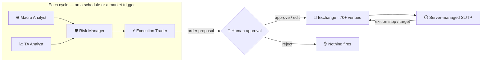
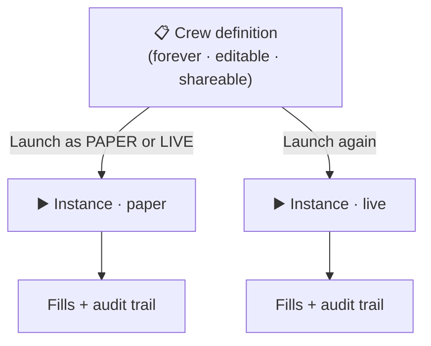
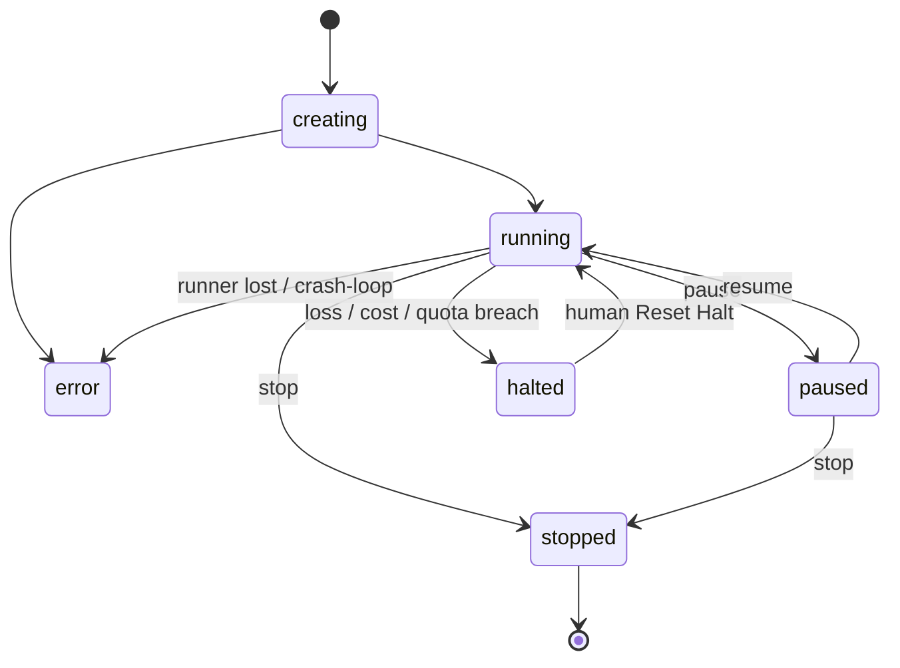

# AI agentic trading

**AI agentic trading** on Melaya means autonomous, multi-agent **trading crews** — teams of specialized AI agents that research the market, find setups, size risk, and execute orders, with a human in the loop on every trade and trading-desk safety rails throughout. It is the flagship of the Melaya [agentic orchestration platform](./concepts.md), wired directly into the [unified engine across 70+ venues](./exchanges.md).

This page describes the capability end to end at a product level: what a crew is, how you build one, how a cycle runs, how it stays safe, and where it runs. The strategy logic, agent prompts, and engine internals are proprietary and not published here.

---

## 1. What a trading crew is

A trading crew is a **pipeline of specialized AI personas**, each with its own scoped toolkit, model, and job, instead of one over-loaded "trading bot" prompt. Each persona reasons in its own lane and hands a structured result to the next. A typical crew:



### Definition vs. instance — build once, launch many

A crew has two distinct lifetimes, and keeping them separate is what makes crews reusable:

- A **definition** is the saved, editable, shareable blueprint of the crew — its personas, models, tools, universe, cadence, and safety settings. It lives in your strategy library forever. You can edit it, clone it, or share it with your team.
- An **instance** is one *launch* of a definition — a running container with a lifecycle (`creating → running → paused/halted/stopped`). You can run several instances of the same definition at once (for example, a paper instance and a live instance side by side).



Editing the definition never disturbs a running instance. Stopping an instance never deletes the definition.

---

## 2. The personas

Melaya ships **seven trading personas**. You pick which seats to fill, the model behind each, and the data each one can read. Every persona is read-and-reason **except** the Execution Trader, which is the only seat allowed to write.

| Persona | Job | Output |
|---|---|---|
| 🌐 **Macro Analyst** | Frames the regime against rates (FRED), DXY, equities, on-chain flows, funding skew, and recent liquidation clusters. | A regime label (`RISK_ON` / `RISK_OFF` / `CHOP` / `VOL_EXPANSION`) and a per-asset macro score. |
| 📈 **TA Analyst** | Confirms directional setups on multi-timeframe price action; identifies nearest support/resistance and places a tactical stop + take-profit as **absolute prices**. | Per-asset entry zone, stop-loss, and one or more take-profit targets. |
| 🧮 **Quant Analyst** | Discovers and ranks systematic edges from order flow, regime indicators, and funding skews; reads candles + funding + open interest together. | Ranked setups with an edge estimate, a confidence interval, and the assumed regime. |
| 📰 **Sentiment Analyst** | Surfaces narrative catalysts — regulatory, hack, listing, partnership, earnings — that could move the chosen instruments inside the cycle window. | Each catalyst with direction, confidence, and time-to-event. |
| 🛡️ **Risk Manager** | **Holds the veto.** Enforces per-position notional caps, portfolio exposure limits, and drawdown rules; turns signals into a *sized* order or blocks them. | Go / no-go **and** the sized notional — never just yes/no. An explicit veto marker blocks the trade outright. |
| 🧭 **Portfolio Manager** | Oversees the whole book — pauses, resumes, or rebalances across positions based on aggregate equity, regime shifts, and correlation/concentration. | Cross-position actions (all human-approved). |
| ⚡ **Execution Trader** | The **only** seat allowed to place orders. Translates the approved plan into exact exchange calls — single entry with attached stop-loss and take-profit — and stops the instant you reject. | Placed orders + a structured fill/skip summary. |

Run any subset, in **sequence or in parallel**. A common pattern is *Macro ∥ TA → Risk → Execution*: the analysts run concurrently, the Risk Manager waits for both, and only then does Execution get a sized plan. Each seat picks its own model independently: a strong cloud model on Risk for an airtight veto, a fast local model on TA for free, low-latency reads.

---

## 3. Composing a crew — the build wizard

You assemble a crew in the Studio through an **eight-step wizard**. Start from a shipped template and adapt, or build from scratch.

| Step | What you do |
|---|---|
| **1 · Crew** | Pick a template (or start blank) and name the crew. |
| **2 · Tools** | Choose the crew's toolkit from the catalog. Account-state and core WSS feeds are **mandatory** (locked on) so every persona can see balances, positions, and the live tape. |
| **3 · Context** | Add reusable context documents (house rules, execution preferences, data-quality guidance) and grant each one to specific personas. |
| **4 · Orchestrate** | Lay out the persona pipeline on a canvas — order the seats, mark which run in parallel, and pick a **model per persona**. Optionally scope a tighter toolkit to an individual persona. |
| **5 · Universe** | Pick the exchange and the symbols. The universe is fetched live from the venue with click-to-add tiles. |
| **6 · Cadence** | Choose how often the crew thinks — a timer, market triggers, or both (see §5). |
| **7 · Safety** | Arm the reactive watchers (see §10) and set the hard caps — max writes per cycle and daily LLM cost cap. |
| **8 · Review** | A summary card: mode, exchange, cadence, universe, the persona chain, tool count, and every cap — confirm, then **Save** the definition. |

From your strategy library you then launch the saved definition as **Paper** or **Live**.

### The toolkit

Tools are organized into groups; each tool is either a **read** (analysts use these freely) or a **write** (only the Execution seat, and always gated). Highlights:

- **Market data** — OHLCV, tickers, orderbook, public trades, open interest, funding rates, liquidations, market constraints, and **live WSS streams** (ticker, orderbook, bar-close OHLCV, public trades, liquidations) plus mid-cycle subscribe/unsubscribe.
- **Account state** — accounts, balances, open orders, positions, order/trade history — REST and **live private WSS push** (balance, positions, open orders, fills) in live mode.
- **Order placement** *(write)* — place / cancel / cancel-all, set leverage, flatten-all, plus their **paper-trade (sim)** equivalents.
- **Cross-source price & metrics** — CoinGecko, CryptoCompare, CMC, DefiLlama for non-venue confirmation and global metrics.
- **Derivatives & sentiment** — Coinglass funding / OI / liquidations / long-short ratio, news sentiment.
- **News & social, BTC on-chain, Macro & on-chain** — headlines, Reddit, stocks/FX, DXY/VIX/yields, ETH reads, web search/fetch.
- **Regulatory & economic** — SEC EDGAR, FRED, BLS, Congress, arXiv/OpenAlex — the ground-truth layer beneath market signals.
- **Predictive markets** — one unified surface across Polymarket, Kalshi, and more.
- **Messaging & alerts** *(write)* — Telegram, Slack, Discord, WhatsApp/SMS/voice, email, Twitter so a crew can self-report fills.
- **User data & integrations** — Google Sheets/Drive/Docs, local Excel/Word, files, Airtable, GitHub — plug in your own watchlist, allocation, or research and write a journal/report.

You can scope tools **per persona**: leave a persona's toolkit empty to inherit the full crew toolkit, or drag specific tools onto it to restrict exactly what it can touch.

---

## 4. How a cycle runs

Once launched, a crew runs a loop:

1. The crew **wakes** on its cadence: a timer, a market **event trigger**, or a hybrid of both.
2. **Safety checks run first.** If a loss/cost/quota halt or a reactive blocker is tripped, the cycle is skipped (see §10–11).
3. **Analysts pull live market data** through the unified API and produce structured signals.
4. The **Risk Manager** turns signals into concrete, sized orders, or vetoes them.
5. The **Execution Trader** proposes each order, then **pauses for your approval**.
6. On approval, the order routes to the venue; a **server-side watcher manages the exits**.
7. The crew **sleeps** until the next tick or trigger, then repeats.

Personas can be wired sequentially or in parallel; an analyst's structured output becomes the next persona's input. A full multi-persona cycle typically takes anywhere from ~30 seconds (fast cloud models) to several minutes (local models) of wall-clock time, which is why cadence is designed around real cycle latency, not an idealized tick rate.

---

## 5. Cadence & event triggers

Crews run on whatever rhythm the strategy needs. There are three modes:

- **Time** — a pure schedule (e.g. a daily scan of the majors, or an hourly pulse). Deterministic, predictable.
- **Event** — the crew waits on a market condition and fires when it trips, with a **cooldown floor** so it never fires more than once per interval. A liveness timer guarantees it still wakes periodically even when the market is quiet.
- **Hybrid** — a routine timer **plus** event preemption: whichever fires first wins, so a big macro move can jump the queue instead of waiting for the next tick.

Presets range from a 1-minute hybrid up to 4-hour and daily schedules, each carrying the mode that makes sense for that horizon. (Sub-minute "real-time" cadences are intentionally not offered: a multi-persona LLM cycle can't meaningfully complete that fast, so the event-mode cooldown is the honest equivalent.)

**Event triggers** are built in a composer with two modes:

- **Preset templates** — price drop ≥ X%, price pump ≥ X%, liquidation cluster > $N, or a single-bar volume spike.
- **Custom expression** — a sandboxed expression evaluated against the live feed, with a tightly whitelisted set of operations (no arbitrary code).

Triggers fire on the **rising edge only** and are debounced, so a volatile tape produces at most one cycle per interval rather than a storm.

> **Why "daily" doesn't mean a thundering herd.** Daily crews don't all fire at the same instant — each one is given a deterministic, evenly-spread offset across the 24-hour window, so the fleet self-distributes instead of stampeding at midnight UTC.

---

## 6. How the crew sees the market

Analysts don't just snapshot a price at the top of a cycle; the crew maintains a **live market view** in the background:

- **Streaming snapshots.** The crew subscribes to the venue's WSS feeds and always holds the latest frame for each symbol, so a persona's first read is instant and current.
- **Timeline drain.** When a persona needs the *sequence* of what happened during the cadence sleep — a liquidation cascade building, a run of fills — it can drain the buffered timeline, not just the latest value.
- **Freshness budgets.** Every streamed value carries its age. Each feed has a freshness budget (tighter for orderbook, looser for bar-close candles); when a frame goes stale, the persona is taught to mark it and fall back to a REST read for that call. The crew never silently trades on a frozen tape.
- **Live private feeds (live mode).** Balances, positions, open orders, and fills can stream directly from the venue so the Risk Manager and Execution seat see acknowledgements without a separate poll.

The net effect: sub-second reactivity from a market event to the crew starting a cycle, with explicit data-quality guarantees baked into how personas reason.

---

## 7. Human-in-the-loop on every order

Every order-placing tool is gated. When the Execution Trader wants to place, modify, or close a position, the run **pauses and surfaces an approval card** with the exact order: symbol, side, size, entry, stop, and target.

You can:

- **Approve** — the order fires exactly as shown.
- **Edit** — change the arguments before it fires; your values override what the agent proposed (the original is preserved for audit).
- **Reject** — nothing fires; the crew is told and moves on.

When the crew proposes several orders at once, they're **coalesced into a single card** with per-row approve/reject, so you act on the whole batch in one decision instead of clicking through each. Analysts and the Risk Manager can read and reason all they like; **only the Execution persona can write, and even it cannot act without you.**

Every decision, and every fill it leads to, is recorded in a complete audit trail (the request, who decided, what they changed, and the resulting execution), so any cycle can be reconstructed as "what did this crew do, by whose authority?"

> **Today vs. roadmap.** Approval on every order is currently **always-on** for live crews, and approvals are actioned in the Studio approval queue. A **programmatic approvals API** (receive an approval request, then approve / edit / reject in code) and the option to **selectively disable HITL** for fully-autonomous live crews are both on the roadmap, arriving with the broader agent API in v2.

---

## 8. Server-managed stop-loss & take-profit

Exits don't depend on the agent staying awake. Once an entry is approved, Melaya's engine **manages the stop-loss and take-profit server-side**, continuously watching the live tape and firing the close leg the moment price crosses your level. The Execution seat places a **single entry with the stop and target attached**; there are no fragile follow-up orders to manage. Works for spot and perpetuals.

This is also why the safe default on shutdown is to **leave** open positions: the venue-side SL/TP *is* the safety rail, so a crew that stops still has its exits protected. (A crew can optionally be set to flatten everything on shutdown instead.)

---

## 9. Paper or live

The same crew definition backs both:

- **Paper** — a simulated broker, no real capital. Same approval flow, same audit trail, same cadence — it just routes through the sim broker so the whole pipeline is exercised end to end without money at risk.
- **Live** — a connected exchange account.

Mode and account are **launch-time choices**: build and validate once, deploy where you choose.

> **Paper-soak before live.** Live keys stay locked until a crew has cleared a paper-mode soak window (a minimum runtime *and* a minimum number of simulated fills). You can't trip the wrong account by accident on day one — a crew earns its live toggle by proving itself in paper first.

---

## 10. Reactive sidecars

Beyond the in-cycle logic, every crew can boot up to **four independent watchers** that run *beside* the cycle loop. Two are **blockers** (they reject writes the instant their sensor trips, before the approval card is even shown) and two are **triggers** (they wake the crew early). You arm the loadout you want in the Safety step.

| Watcher | Type | Sensor → Action | What it does |
|---|---|---|---|
| 🩸 **Drawdown Sentinel** | Blocker | Equity vs. peak → **blocks writes** | Watches session equity on a sub-second loop. If equity falls 5% from the session peak (or the day's loss reaches 2% of starting equity) the pipeline flips RED and every pending write is auto-rejected. Clears on its own once equity recovers; reads and analysis keep running throughout. |
| 🛡️ **Macro Blackout** | Blocker | Macro calendar → **blocks entries** | Stands down around scheduled releases (FOMC, CPI, NFP): from 30 minutes before to 60 minutes after, new entries are rejected. Resumes automatically once the window closes. |
| 🔁 **Funding Flip** | Trigger | Funding sign → **fires a cycle** | Polls funding on the symbols the crew actually holds. A sign flip invalidates the carry assumption behind a position, so it wakes the crew at once for the Risk Manager to reprice. A pure accelerator — it never blocks. |
| 🌊 **Liquidation Cascade** | Trigger | Liquidation feed → **fires a cycle** | Sums forced liquidations across watched symbols over a rolling 60-second window. Past a large-notional threshold it fires an immediate extra cycle so the crew can fade the flush or stand aside on purpose. Also a pure accelerator. |

The blockers matter because they catch **in-flight** breaches: even if a cycle starts healthy and conditions deteriorate mid-reasoning, a write that would otherwise slip through is rejected at the gate.

---

## 11. Safety rails (trading-grade discipline)

Autonomous trading is only safe with guardrails. On top of the sidecars, Melaya enforces a layered set of rails, many at the platform/middleware level, so they hold **regardless of what the LLM does**:

- **Scoped permissions** — only the Execution persona can place orders; analysts are read-only.
- **Human approval on every order** — *every order signed by a human*, with a full audit trail and per-row batch approval.
- **Risk veto** — the Risk Manager can block any trade outright before it's sized.
- **Per-cycle write cap** — a hard ceiling on write calls per cycle (tunable down). A runaway "panic loop" is rejected before a single card reaches you.
- **Daily order quota** — a per-account daily cap (by tier); rejected attempts don't burn the budget.
- **Daily LLM cost cap** — a per-day spend ceiling halts a crew that's burning tokens (not applicable to fully-local crews, which still track usage for observability).
- **Loss circuit breakers** — cumulative-drawdown and consecutive-loss limits pause a crew automatically; a halted crew requires a deliberate human reset, not just a resume.
- **Tenant isolation** — when many crews share infrastructure, each one's approvals and state are strictly isolated; one user's approval can never release another's order.
- **Egress allowlist** — a crew container can't reach exchanges or arbitrary URLs directly. All order flow goes through Melaya's engine; venue requests originate from Melaya's own egress, never the crew's host.
- **Server-enforced tool allowlist** — a crew can only use tools on the trading allowlist, enforced at both the API boundary and at container-build time.
- **Paper-soak gate** before live (see §9).

---

## 12. Where a crew runs — cloud or your own machine

Where a crew executes depends on its runtime mode, but the **trust posture is consistent**: the crew only ever talks to Melaya's API and feeds, and **all venue requests route through Melaya's engine from Melaya's egress IP**. You whitelist Melaya's egress on your exchange, never your laptop.

| Mode | Runs on | LLM prompt visibility |
|---|---|---|
| **Cloud pool** | Melaya's infrastructure (pooled, multi-tenant-isolated) | Melaya proxies the LLM call |
| **Local runner** | Your own machine (Mac mini / NUC / Apple Silicon) | **Direct** — prompts and your model key never touch Melaya |

Local-runner mode is required when any persona uses a **local model provider** (so your prompts stay on your hardware), and is the default for the highest tiers. In local mode, order intent and fills still flow through Melaya for the approval gate and audit chain, but the reasoning, the model key, and the crew code stay on your box. Market data is public either way.

---

## 13. Lifecycle & operations

A launched crew moves through a clear state machine:



- **Pause / resume** take effect within the next cycle tick — no restart needed.
- **Halt** is different from pause: a circuit-breaker halt won't clear on a plain resume. The crew surfaces a halt card with its own *Reset Halt* button, because a halted crew needs human reasoning ("did I check *why* it was losing?") before it trades again.
- **Stop** is terminal for that instance; relaunch from the definition any time — fresh container, fresh state, definition untouched.
- **On shutdown**, the default is to **leave** positions (venue-side SL/TP protects them); a crew can opt to flatten instead, in which case the flatten orders are auto-approved purely on the shutdown path.
- **Crash recovery** is automatic: orphaned cloud crews are reassigned, and a local runner that drops is detected via heartbeat and surfaced as an error you can relaunch.

---

## 14. Shipped templates

Three ready-to-run crews you can launch as-is and then adapt. All default to **paper**.

| Template | Cadence | Universe | What it does |
|---|---|---|---|
| **Live Demo Crew** | 10-min schedule | BTC / ETH / SOL | A demo-tuned crew on a four-rule rubric (trend / revert / breakdown / range-edge) plus funding-squeeze and post-purge overrides at a 1/3 confluence floor, so at least one setup surfaces per cycle. ATR-anchored stops, side-check on every row, GREEN/YELLOW/RED portfolio rating. The fastest way to *watch the crew work*. |
| **Daily Majors Long** | Daily (time) | BTC / ETH / SOL / BNB / AVAX | The "real" graduation strategy: conservative **long-only** entries, 2/3 confluence with funding/post-purge overrides, ATR-anchored stops, R:R ≥ 1.5, portfolio risk rating, and a release-window blackout. ≤ 0.5% equity per trade, ≤ 5% total exposure, ≤ 5 concurrent positions. |
| **Intraday TA Reactive** | Hourly pulse + price-drop triggers (hybrid) | Majors | A TA-driven reactive crew on the 5-minute charts. Woken by the hourly timer *or* a per-symbol price-drop trigger (4% from the 24h high); the TA seat decides cascade-fade vs. structural-breakdown, Risk sizes bidirectionally with hard caps, Execution places one order per row. |

Clone any template from your library to spin up a variant (e.g. *Hourly Mid-Caps*). The clone is a fresh, private definition with the payload copied; edit cadence, universe, and personas from there.

---

## 15. A cycle, worked end to end

A single Daily Majors cycle, abbreviated:

```
00:42 UTC — cycle #127 starts (jittered offset; safety checks pass)

1. Macro Analyst
   reads Fed funds 4.25%, DXY down 1.2% over 5d, 24h liqs $42M long vs $89M short,
   funding mild-positive →  BTC: LONG_OK · ETH: LONG_OK · SOL: LONG_CAUTION
                            BNB: LONG_OK · AVAX: LONG_BLOCK

2. TA Analyst   (skips AVAX — macro veto)
   reads daily + 4h bars per symbol →  BTC: entry 104500 / SL 101200 / TP 111900, confluence 3/3
                                       ETH: no setup · SOL: 2/3 · BNB: no setup

3. Risk Manager
   equity $10,000, one ETH long open ($200). 5% total-exposure cap leaves ~$300 room →
   BTC: trade $300 notional · SOL: veto (exposure cap) · rest: skip

4. Execution Trader
   place_order BTC buy limit-post-only, qty sized, SL 101200 + TP 111900 attached
   → approval card shown → operator approves in 4s
   → sim fill @ 104487; server-side watcher now owns the exits

cycle #127 ends — placed 1, vetoed 2, skipped 2.  Next cycle ~24h later.
```

Every `place_order` above is a human-approved card; every fill lands in the audit trail stamped with the approval that authorized it.

---

## Get started

Build your first crew from a template in the Studio, run it in **paper**, watch it argue through a few cycles, and approve a trade or two. When it's earned its soak, flip it to **live**. Prefer code? Launch the same crew via the API: see **[Launching a trading crew](./trading.md#launching-a-trading-crew)** for the full `agent_crew` payload (per-persona tools, steps, context, cadence, safety).

See **[melaya.org](https://melaya.org)** to get started, and the [concepts](./concepts.md), [trading & strategies](./trading.md), and [exchanges](./exchanges.md) pages for the orchestration and market-API foundations underneath.
