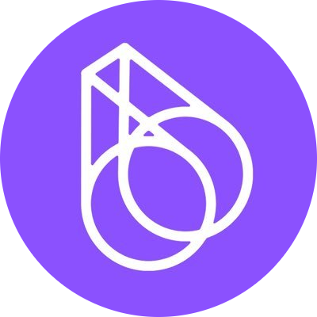
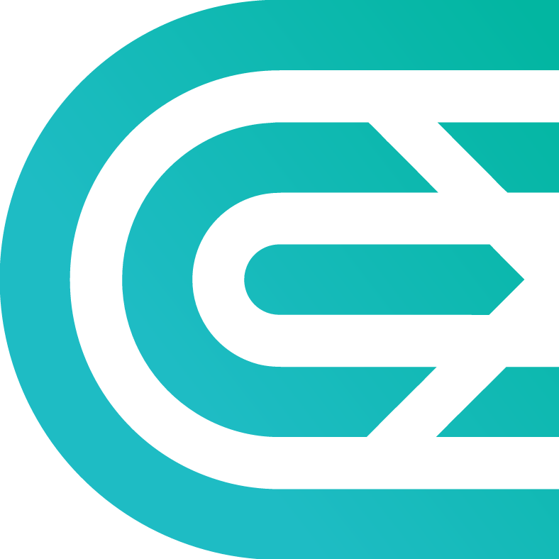
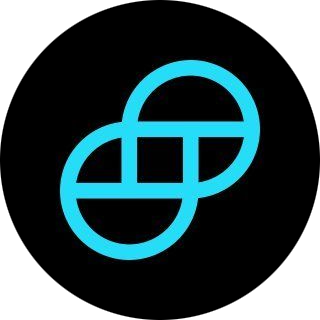
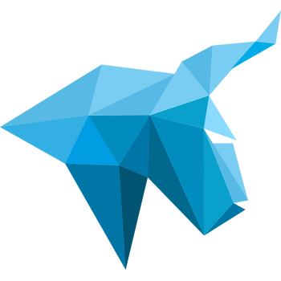
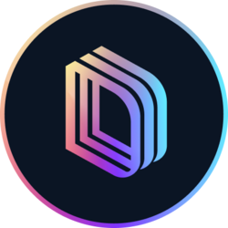

# Exchanges & the unified API

Melaya exposes **one normalized REST + WebSocket API over 70+ venues**, backed by an in-house Rust engine. You write your integration once against the Melaya schema; the engine handles each venue's symbol formats, rate limits, settlement suffixes, funding intervals, and connection lifecycles.

This page is the **venue catalog, the normalized schema, and authentication**. The endpoint reference is split across two companion pages:

- **[Market data & streaming](./market-data.md)** — REST reads (ticker, order book, OHLCV, trades, funding, open interest, liquidations) and the public WebSocket streams.
- **[Trading & strategies](./trading.md)** — account, paper (sim) trading, live trading, backtesting, launching `custom` strategies and `agent_crew` [trading crews](./agentic-trading.md), and the private streams.

Official SDKs wrap the whole API in **9 languages** — TypeScript/JavaScript, Python, Go, Rust, Java, Kotlin, C#/.NET, Ruby, and PHP (see [`packages/`](../packages)). One `mk_` key unlocks the whole surface.

## Supported venues

The 70+ venues break down into two families that **share one API surface**:

- **Centralized exchanges & perpetuals** — **60 spot exchanges** plus **5 perpetual-futures venues** (binanceusdm, bingxfutures, bitgetfutures, bybitlinear, okxswap).
- **Prediction markets & DEX** — **6 venues** (azuro, drift_pm, kalshi, overtime, polymarket, sxbet).

**One API, both families.** CEX, perpetuals, and prediction markets are all reached through the **same normalized REST + WebSocket schema, the same `mk_` key, and the same SDK methods** — you select the venue with the `exchange` (CEX/perp) or `venue` (prediction-market) parameter. There's no separate client and no separate auth: a ticker is a ticker, an order is an order, a stream is a stream, whether it's Binance spot, a Bybit perp, or a Polymarket event contract. Prediction-market listings come from `POST /api/v1/market/pm-markets` and the PM trading surface follows the identical call pattern (see [Market data](./market-data.md) and [Trading](./trading.md)). A machine-readable dataset — id, display name, market type, auth requirements (passphrase / application-id), and native ticker-stream support — is published here: [`data/exchanges.json`](../data/exchanges.json) · [`data/exchanges.csv`](../data/exchanges.csv).

### Centralized exchanges & perpetuals

<p align="center">
  
  
  
  
  
  
  
  
  
  
  
  
  
  
  
  
  
  
  
  
  
  
  
  
  
  
  
  
  
  
  
  
  
  
  
  
  
  
  
  
  
  
  
  
  
  
  
  
  
  
  
  
  
  
  
  
  
  
  
  
  
  
  
  
  
</p>

### Prediction markets & DEX

Same schema, same `mk_` key, same streams — addressed by `venue` (e.g. `polymarket`, `kalshi`). Listings via `POST /api/v1/market/pm-markets`.

<p align="center">
  
  
  
  
  
  
</p>

### Enabled on demand

The venues above are the **validated, live** set — the ones currently activated for trading and reflected in `list-exchanges`. The engine carries **integrated adapters for additional venues** that aren't switched on yet, including major derivatives and perp-DEX venues such as **Deribit, BitMEX, Gate, HTX (Huobi), dYdX, Apex, Paradex, Delta, and Derive**, plus inverse / COIN-M and other perpetual markets on venues already listed. These are **pluggable but enabled on demand**: each is activated once it clears validation testing, which we prioritize when a customer wants to trade there. If your strategy needs a venue you don't see in the list, ask us to enable it — the adapter usually already exists.

The live, always-current list of **activated** venues is available programmatically (the dataset above is a snapshot; this endpoint is the source of truth):

```
GET https://api.melaya.org/api/v1/market/list-exchanges
```

## Bases & authentication

- **REST base:** `https://api.melaya.org`
- **WebSocket base:** `wss://wss.melaya.org`
- **Auth:** API keys prefixed `mk_`, passed as `?apiKey=mk_...` (query) or `Authorization: Bearer mk_...` (header).

Market data, account/strategy reads, paper trading, and backtesting need only the `mk_` key. **Live** order placement and live strategy/crew launches additionally require a connected exchange key (referenced by `apiKeyId` — connect one in the dashboard → **Settings → Connectors**). Full read/write breakdown on the [Trading & strategies](./trading.md) page.

## Normalized schema

Regardless of venue, market data comes back in one shape — e.g. a ticker always exposes `bid`, `ask`, `last`, `high`, `low`, `baseVolume`, `quoteVolume`, and `timestamp`. This is the whole point: your code does not branch per exchange.

> Coverage and capabilities evolve. Always treat `GET /api/v1/market/list-exchanges` and the per-venue capability fields as the source of truth rather than hardcoding a venue list.

## Where next

- **[Market data & streaming →](./market-data.md)** — every REST read + the public WebSocket streams.
- **[Trading & strategies →](./trading.md)** — account, paper, live, backtesting, and launching `custom` + `agent_crew` strategies.
- **[AI agentic trading →](./agentic-trading.md)** — the conceptual guide to trading crews.
