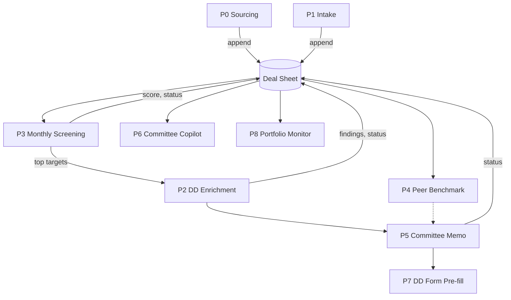

# Worked example: an investment team copilot (9 pipelines)

A fully anonymized system built with this method for an early-stage investment team. The client had shared no private data during the build, so every pipeline proves value on keyless public sources plus whatever a user hands a single run (a brief and files). All tool ids below exist in the platform registry; still re-verify them with `melaya_pipeline_registry` in your own account before use.

## 0. Frame

Requirements (abridged):

| Id | Outcome |
|---|---|
| R1 | Keep a funnel of real startups that raised recently and fit the fund thesis |
| R2 | Turn an inbound deck or submission email into a structured record |
| R3 | Screen and rank the whole funnel every month on fixed criteria |
| R4 | Run keyless due diligence (corporate identity, sanctions, licensing, traction) on a target |
| R5 | Benchmark a target's valuation and round against peers |
| R6 | Draft an investment committee memo |
| R7 | Pre-fill the team's internal DD forms from evidence |
| R8 | Answer committee questions from approved materials only |
| R9 | Monitor portfolio companies monthly |

Pilot scope: public data only; every email goes to the owner's own inbox; production gates every outgoing email.

## 1. Discover

- `melaya_setup_status`, `melaya_account_usage`, `melaya_connector_list`.
- Registry searches: "rss", "sanctions", "gleif", "edgar", "licence register", "sector data", "github", "traffic", "gdelt", "deck", "sheets", "word", "drive", "gmail", "decide".
- `melaya_model_list` for the validation provider: a fast mid-size cloud model.
- Keyless coverage found for R1, R3, R4, R5, R9 (news feeds, entity registries, filings, sanctions lists, a regulator licence register, sector market data, code activity, web traction). Google Workspace (Drive, Sheets, Docs) and Gmail were the only connectors needed.

## 2. Connect

`melaya_connector_connect` for the Google Workspace services and Gmail, user consented, `melaya_connector_test` per service, then one `melaya_connector_call` reading a Drive search to prove the grant.

## 3. Project

One project was created for the system (today `melaya_project_create` does this over MCP); `melaya_team_list` confirmed it. All nine pipelines were authored raw (no template matched the domain closely enough).

## 4. Design

Shared constants (generator):

- `THESIS`: 2 to 4 sentences: sectors, stages, priority geography.
- `PROVENANCE`: every field has `<field>__src` (URL or document) and `<field>__status` (SOURCE / INFERRED / MISSING); never invent a number; a failed source is MISSING, never "clear".
- `ROW_RULE`: header is row 1; items come back as `[row N]`; write back by exact row and fixed column letters.
- `RELIABLE`: tool order (1) registry/data tools, (2) a KNOWN URL with `scrape_page`, (3) RSS and news events, (4) `web_search` only to discover URLs, then open the page.
- `DESIGN`: every human-facing output via `word_create` blocks (cover, heading, paragraph, bullets, callout, table) with a theme, published with `drive_upload` as a Google Doc; the reply lists `FILE:` paths.
- `HUMAN` writing rules and `ONE_SHOT_SEND` ("call gmail_send exactly once; a second call is a failure").
- `SPINE`: one Sheet with a unique name, tab "Deals", a few dozen fields each with `__src` and `__status` where sourced.

Dependency graph:

## 5. The pipelines (as generated)

`->` sequential, `[a | b | c]` parallel step with `joinStrategy: "concat"`.

| # | Pipeline | Steps | Key tools |
|---|---|---|---|
| P0 | Deal Sourcing | Scout -> Recorder | Scout: `rss_search_entries`, `decide_batch`, `scrape_page`, `web_search`. Recorder: `drive_search`, `dealdb_schema`, `sheets_create`, `sheets_read_range`, `dealdb_dedupe`, `dealdb_normalize`, `sheets_append_row` |
| P1 | Deal Intake | Intake Analyst -> Recorder -> Mailer | `read_run_input`, `deck_extract`, `gmail_search`, `gmail_get_attachments`, `pdf_render_pages`, `ocr_image`, `scrape_page`, `web_fetch` |
| P2 | DD Enrichment | Target Resolver -> [Corporate and Sanctions \| Licensing and Regulatory \| Traction and Technology] -> DD Writer -> Mailer | `gleif_search_entities`, `edgar_form_d_search`, `sanctions_screen_batch`, a licence-register tool, `webtraffic_traction_report`, `github_developer_scorecard`, a sector data tool, `gdelt_search_articles`; writer: `word_create`, `drive_upload`, `sheets_update_range` |
| P3 | Monthly Screening | Scorer -> One-Pager Writer -> Mailer | `sheets_read_range` (save_to), `decide_batch_file`, `dealdb_rank`, `sheets_update_range`; writer: `word_create`, `drive_upload`, `excel_write_data`. Schedule: monthly cron |
| P4 | Peer Benchmark | Benchmark Analyst | `sheets_read_range`, `dealdb_benchmark`, `dealdb_normalize`, `rss_search_entries`, `word_create`, `drive_upload` |
| P5 | Committee Memo | Memo Intake -> [Market \| Team and Product \| Financials and Valuation \| Risk and Fit] -> Memo Writer -> Mailer | `deck_extract`, `docs_read`, `dealdb_benchmark`, `sanctions_screen_batch`, `github_developer_scorecard`, `gdelt_search_articles` |
| P6 | Committee Copilot | Copilot | `read_run_input`, `deck_extract`, `drive_search`, `docs_read`, `sheets_read_range`; answers only from approved materials, cites each claim |
| P7 | DD Form Pre-fill | Evidence Collector -> Form Filler -> Mailer | `docs_read`, `sheets_read_range`, `gleif_search_entities`, `sanctions_screen_batch`, the licence-register tool; filler: `word_create`, `drive_upload` |
| P8 | Portfolio Monitor | Watcher -> Reporter -> Mailer | `rss_search_entries`, `gdelt_search_articles`, `webtraffic_traction_report`, `github_developer_scorecard`, `sanctions_screen`; schedule: monthly cron |

Every agent: `loop_policy` `{"mode": "observe_only", "evaluator": "default"}`, `include_context: false`. Pipeline: `hitl_mode: "safe"`, `persistent_memory: false` (the Sheet is the memory).

Patterns that made it work:

- **Parallel analysts lose step-1 lines.** The concat join contains only the parallel replies, so one analyst is instructed to start its reply with the TARGET / SHEET / ROW lines of the previous message copied unchanged.
- **Recorder** (shared factory): find-or-create the Sheet, read it to `deals.json`, dedupe each record in one parallel batch (score >= 0.92 skip), `dealdb_normalize` all survivors at once to `new_deals.csv`, `sheets_append_row` with `csv_path`. Never `row_json` for wide rows.
- **Screening from files**: `sheets_read_range` with `save_to`, then `decide_batch_file` with `items_path` = that file, `item_template` = `"{company} | {country} | {sector} | {stage}"`, `include_if` on status; items come back as `[row N] ...`; write back score, status and timestamp to contiguous fixed columns by row.
- **Bounded sourcing**: at most 40 tool calls; phase 1 one parallel batch of feeds (targeted news RSS queries), phase 2 one `decide_batch` triage of all headlines, phase 3 one parallel batch of confirmations with `scrape_page`; stop at TARGET. This took a run from 28 minutes / 110 calls to 7 minutes with 15 real records.
- **Mailer** (shared factory): `gmail_my_address` then exactly one `gmail_send`, subject different from body, attachments = the `FILE:` paths, plain ASCII, never forward a raw error (name the service and the reconnect page instead).

## 6. Validate

Order: P0 -> P1 -> P3 -> P2 -> P4 -> P5 -> P7 -> P6 -> P8. For each: `melaya_pipeline_run` with a brief (P1, P5, P6, P7 also with a public sample deck in `files`), poll `melaya_run_status`, read `melaya_run_inspect` with tool calls, `melaya_run_diagnosis`, then read the Sheet range and open the produced Doc with `melaya_connector_call`.

## 7. Defects found and how they were classified

| Symptom | Class | Fix |
|---|---|---|
| Rows misaligned; cells shifted after append | Design | Stop the model retyping rows: normalize to CSV, append by `csv_path` |
| Scorer saw only a few rows of a wide sheet | Design | Read with `save_to`; take row counts from the file summary, not from the returned grid range |
| Recorder wrote into an older, similarly named sheet | Design | Rename the spine so it shares no full word set with older files |
| Sourcing agent made 110 sequential calls | Config | Bounded phases, hard budget, batch triage |
| Repeated 404s on guessed `/about` pages | Config | `scrape_links` on the home page, then open known links |
| List arguments sent as JSON strings | Platform | Fixed by Melaya (arguments are now coerced); configs re-saved only after the release |
| Keyless HTML search blocked | Platform | `web_search` falls back through the agent's provider search and news RSS; re-validated after the release |
| Old failure notes replayed after tools were fixed | Config | `persistent_memory` off; the Sheet is the memory |
| Gated send never fired in autonomous mode | Config | `hitl_mode: "safe"` is the mode that honours per-agent `human_approval_tools` |

## 8. Document

Hub, ELI5 glossary, run inputs/schedules/triggers, tools catalogue, data model and provenance, branded documents, security and human control, and one note per pipeline built from the same template, each with a real example from its validation run.

## 9. Hand over

Monthly crons armed for P3 and P8 with `melaya_pipeline_schedule` (`set`, then `status`). Production switch: `gmail_send` added to every mailer's `human_approval_tools`. Client team invited after the user confirmed. `melaya_eval_report` baseline captured for the project.
