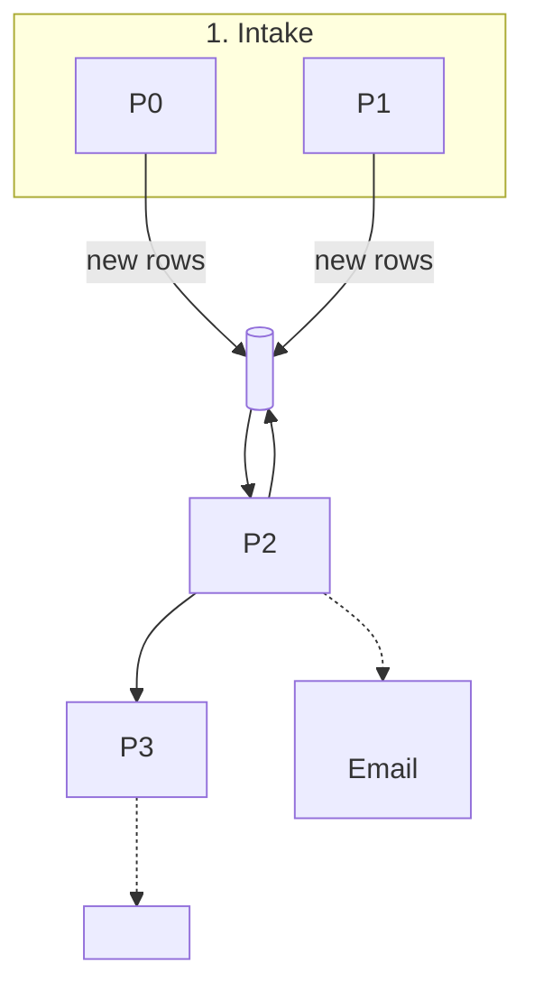

# <System name>

> [!info] What it is, in one paragraph
> <System name> is a set of <N> automated workflows ("pipelines") that act like <team analogy, for example "a junior operations team"> working for <Client>. It <verb 1>, <verb 2>, <verb 3>, keeps every datapoint in <data store>, and produces <outputs>. Every number carries its source. <One sentence on who receives outputs and what waits for human approval, pilot vs production.>

<One short paragraph: what data the pilot uses (for example "public data only, plus material you attach to a run") and why.>

## The <shared context> the pipelines work from

<Only if the configs share a constant text such as a thesis, policy, rubric or brand rule. Quote it verbatim from the config.>

> <verbatim shared context>

Changing it is a one-line edit applied to every pipeline at once.

## Glossary (ELI5)

| Term | What it means | Real-world analogy |
|---|---|---|
| **AI agent** | A language model given one job, a short written brief and a small set of tools. It reads, picks a tool, reads the answer, writes a result | <job-title analogy> |
| **Pipeline** | A fixed sequence of agents; the output of one is the input of the next | An assembly line, or a hand-off chain |
| **Step** | One station in the pipeline; one agent, or several at once ("parallel") | One desk; a parallel step is several people on the same file in separate rooms |
| **Tool** | A precise function an agent may call. Tools return facts. The agent cannot do anything a tool does not allow | The databases and software a person has a login for |
| **Keyless public data** | Official or open sources that need no account: <list the real ones used> | The public reading room of a library |
| **Run inputs (brief and files)** | What you give one run: a short text brief and optional files | The cover note and folder you hand a colleague |
| **Human approval (HITL)** | A person clicks Approve before an action leaves the system. <Pilot: ...> <Production: ...> | A manager signs the letter before it goes out |
| **Provenance tags** | <SOURCE / INFERRED / MISSING, or the system's own scheme> | Footnotes plus a "we do not know" column |
| **<Data store>** | <What and where, width, one row per what> | <analogy> |
| **Memory across runs** | <How the system remembers: the data store, not a private agent notebook> | A shared log, not one person's notebook |
| **Model: <model name>** | The language model every agent uses. It reads, writes and chooses tools. It is never the source of a number | The analyst's reasoning and writing skill |
| <extra term> | <...> | <...> |

More detail: [[01 How a Pipeline Works (ELI5)]].

## The lifecycle across the <N> pipelines

Solid arrows are data flows. Dotted arrows are the artifacts each pipeline produces. <Who receives emails in pilot vs production.>

## Requirement to pipeline traceability

Status legend: **covered** = done today on public data or run inputs. **partly** = part is met, the gap is named. **needs client data** = logic exists, needs <Client> access, templates or history. **not covered (out of scope)** = explicitly excluded.

### 1. <Requirement area, as named in the client document>

| Requirement (quoted) | Pipeline and step | Status |
|---|---|---|
| "<verbatim requirement>" | P<n> <Agent name>: `<tool>` <what it does> | covered |
| "<verbatim requirement>" | <what exists>. <the gap> | partly |
| "<verbatim requirement>" | <what would be needed> | needs client data |

### 2. <Requirement area>

| Requirement (quoted) | Pipeline and step | Status |
|---|---|---|
| "<...>" | <...> | <...> |

### Out of scope, confirmed

None of the <N> pipelines does any of these: <list from the requirement document's exclusions>. Every recommendation is a draft for a human decision.

## The <N> pipelines at a glance

| # | Pipeline | Trigger | Inputs | Outputs | Email |
|---|---|---|---|---|---|
| P0 | [[P0 <Pipeline>]] | <Run now / Run with inputs / schedule `<cron>` (armed or not)> | <brief, files, or none> | <artifacts> | <None / recipient> |
| P1 | [[P1 <Pipeline>]] | <...> | <...> | <...> | <...> |

Run times are not fixed in the configuration. They depend on how many <items> and sources a run touches.

## All notes in this set

- [[01 How a Pipeline Works (ELI5)]]: anatomy of a run, parallel steps, tool choice, what the model does and does not do
- [[02 Run Inputs, Schedules and Triggers]]: Run now, Run with inputs, files, API and MCP, schedules, good briefs
- [[03 Tools Catalogue]]: all <T> tools, grouped, with their source
- [[04 <Data Store> and Provenance]]: schema, normalisation, dedupe, provenance tags
- [[05 Branded Documents]]: designed documents and re-branding
- [[06 Security, Human Control and Compliance]]: approvals, data boundaries, untrusted files
- Pipelines: [[P0 <Pipeline>]], [[P1 <Pipeline>]], <...>
- [[Pipeline Template]]: the structure every pipeline note follows

## Handover

| Item | Done by | Date |
|---|---|---|
| Signed in with own account, sees the project, role confirmed | <name> | <YYYY-MM-DD> |
| Connectors checked; knows how to reconnect a service | <name> | <YYYY-MM-DD> |
| Ran one pipeline with Run now and one with Run with inputs | <name> | <YYYY-MM-DD> |
| Approved or rejected one real approval card | <name> | <YYYY-MM-DD> |
| Opened every output and read the provenance tags | <name> | <YYYY-MM-DD> |
| Knows where to ask for help: their assistant, Report a bug in the app, <integrator contact> | <name> | <YYYY-MM-DD> |
