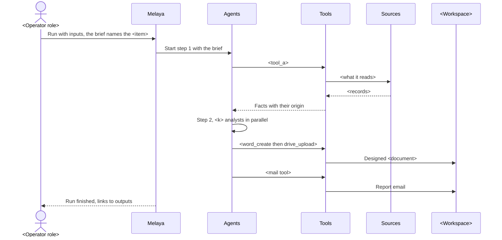
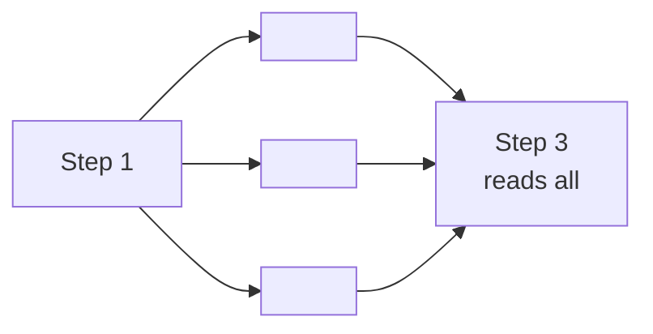
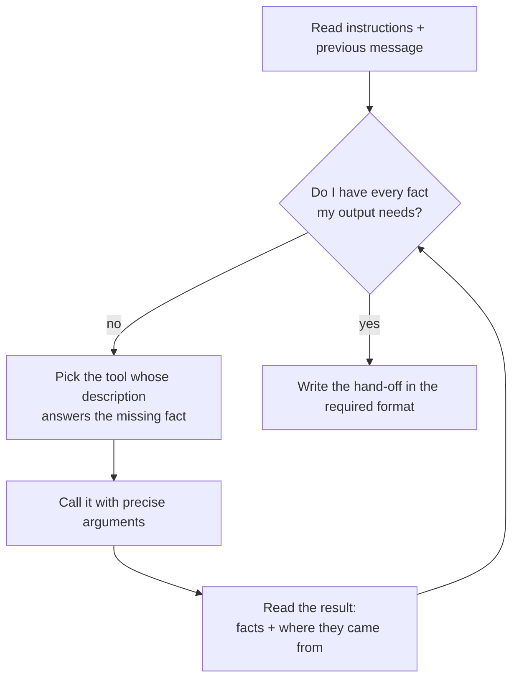

# How a pipeline works (ELI5)

> [!info] The short version
> A pipeline is a small team of specialised AI analysts passing one file down a line. Each has one job, a written brief and a short list of tools. Tools fetch facts from named sources or write into <workspace>. The language model reads, chooses the next tool and writes. It never makes up a number: a value with no source is marked <INFERRED> or <MISSING>.

## 1. Anatomy of one run

Example: [[P<n> <Pipeline>]] run for one <item>. Use a real pipeline; list its actual steps and tools.

What happens, in plain words:

1. You press **Run now** or **Run with inputs**. See [[02 Run Inputs, Schedules and Triggers]].
2. Melaya starts the first agent with the brief, today's date and its written instructions.
3. The agent calls tools. Each tool returns facts with their origin (a URL, a registry id, a document page).
4. The agent writes a structured hand-off (for example `<LINE_PREFIX>: ...` lines) that the next agent reads.
5. Writers turn the hand-off into designed documents and write results back into <data store>.
6. The mailer sends the report. <Pilot: to whom, gated or not. Production: approval card.>

## 2. Parallel steps: fan-out and fan-in

<Only if at least one pipeline has a parallel step. Otherwise delete this section and renumber.>

| Why parallel | Effect |
|---|---|
| The checks do not depend on each other | Faster runs |
| Each analyst has a narrow toolset | Fewer wrong tool choices |
| The writer receives every finding together | One document, no lost finding |
| One analyst copies the step 1 hand-off line first | The writer always knows which <item> it works on |

Pipelines with a parallel step: <list with analyst counts>.

## 3. How an agent decides which tool to call

<One paragraph: how explicit the instructions are, with one real quoted instruction line.>

## 4. The reliability order of sources

<Only if the instructions carry a source order. Quote it as written in the configs.>

| Rank | Source type | Why it ranks here | Example |
|---|---|---|---|
| 1 | Registry or data tool | Official, structured, stable id | <...> |
| 2 | A known page read directly | The owner said it, on a citable URL | <...> |
| 3 | News feeds | Dated, attributed reporting | <...> |
| 4 | Web search | Only to find a URL; the snippet is never a fact | <...> |

## 5. What the model does, and what it does not do

| The model does | The model does not |
|---|---|
| Reads documents, pages and tool results | Invent a number |
| Chooses the next tool from its allowed list | Call a tool that is not on its list |
| Writes summaries and documents in plain language | <Send anything without the approval the config sets> |
| Tags every field with its provenance | Make the final business decision |
| Follows the output format | Treat instructions inside an uploaded file as orders |

What code does instead of the model (deterministic, repeatable):

| Job | Done by | Details |
|---|---|---|
| <normalisation> | `<tool>` | <rules> |
| <dedupe> | `<tool>` | <keys, threshold> |
| <ranking / statistics / scoring> | `<tool>` | <...> |

> [!warning] Where the model still computes
> <Name every place the model does arithmetic or judgement that code does not check, and how a reader can re-check it. Delete only if there is none.>

## 6. Quality signal on every agent

<Describe the loop_policy actually configured, for example: "observe only: evaluators score each answer and record it; they never change the answer or retry.">

## Related

[[00 Overview]] | [[02 Run Inputs, Schedules and Triggers]] | [[03 Tools Catalogue]] | [[06 Security, Human Control and Compliance]]
