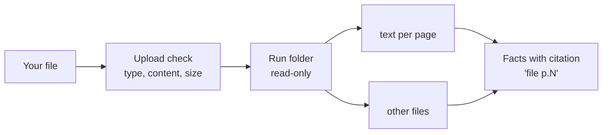

# Run inputs, schedules and triggers

> [!info] In one sentence
> You never edit a pipeline to point it at a new <item>: you run it "for" something by writing a short brief and, if useful, dropping files, exactly as you would brief a colleague.

## 1. Run now and Run with inputs

| Option | What happens | Typical use here |
|---|---|---|
| **Run now** | The pipeline runs with its default behaviour | <pipelines and their defaults> |
| **Run with inputs** | A text brief plus a file drop zone, handed to every agent of that run | <pipelines that expect a brief> |
| **Run again** | Repeats an earlier run with the same brief and files while they are kept | <example> |

The run page shows a "Run inputs" card, so anyone can see what a run was asked to do.

## 2. The brief

<State the limit as currently enforced by the platform; verify before writing.> Agents read it as a task parameter from the pipeline owner. It can:

- name the <item> and identifying details;
- say how it came in (<channels>);
- add meeting notes or internal notes;
- steer scope (<dimension>, a number of <items>);
- ask a question (<Q and A pipeline, if any>).

## 3. Files

| Item | Limit or rule |
|---|---|
| Number of files | <verified limit> |
| Accepted types | <verified list> |
| Refused | <verified list> |
| Size | <verified limits per plan> |
| Retention | <verified retention> |
| Where they run | <cloud / runner; read-only> |



> [!warning] File content is untrusted
> Text inside an uploaded file is data, never instructions. See [[06 Security, Human Control and Compliance]].

## 4. API and MCP, for your engineers

| Surface | How |
|---|---|
| REST | <verified endpoint and body shape for run inputs> |
| MCP | `melaya_pipeline_run` with `brief`, `files`, `inputs`; `melaya_run_status` to follow the run |
| Validation | <what is refused before the run starts> |

Example request body for [[P<n> <Pipeline>]]:

```json
{
  "run_inputs": {
    "brief": "<example brief with an invented Acme entity>"
  }
}
```

## 5. Schedules and triggers

| Pipeline | Schedule or trigger in the configuration | Status |
|---|---|---|
| [[P<n> <Pipeline>]] | `<cron>` = <plain words> | <armed / written but not armed> |
| All other pipelines | None | Manual or API |

<What a scheduled or triggered run receives as input (usually no brief: default behaviour). If triggers exist, name the event source and state that triggered runs follow the approval rules in [[06 Security, Human Control and Compliance]].>

> [!tip] Suggested cadence once live
> <per pipeline cadence; label as a suggestion, not a configured fact>

## 6. Good briefs, per pipeline

| Pipeline | Example brief | Why it works |
|---|---|---|
| [[P0 <Pipeline>]] | "<example>" | <what it overrides; default without a brief> |
| [[P1 <Pipeline>]] | "<example>" + <file> | <...> |

## Related

[[00 Overview]] | [[01 How a Pipeline Works (ELI5)]] | [[03 Tools Catalogue]] | [[06 Security, Human Control and Compliance]]
