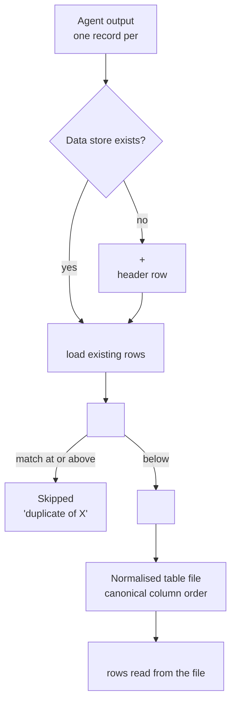

# <Data store> and provenance

> [!info] In one sentence
> <Data store> is one <Sheet / table> where every <item> the system sees becomes one row, and every value carries a footnote (where it comes from) and a confidence tag (<SOURCE, INFERRED or MISSING>).

<One sentence linking it to the client requirement it answers, quoted.>

## 1. Where it lives

| Item | Value |
|---|---|
| File | <type and name pattern, in whose account; never a file id> |
| Tab or table | <name> |
| Width | <C> columns |
| Created by | <pipeline that creates it when absent> |
| Found by | <how pipelines locate it> |
| Written by | <which pipelines add rows, which write back> |
| Read by | <which pipelines> |

## 2. The <C> columns

<F> fields. 
 of them carry `<field>__src` and `<field>__status` companions. <F> + 
 x 2 = <C>. Take the counts from the schema tool or the config, not from memory.

| Group | Fields | Provenance columns |
|---|---|---|
| Identity | `<key>` (row key), `<dedupe key>`, <...> | <yes / no> |
| <Group> | <...> | <...> |
| Workflow | `status`, `score`, `updated_at` | no (they describe the row) |

Controlled values:

| Field | Allowed values |
|---|---|
| `status` | <lifecycle values> |
| `<field>` | <values> |

## 3. How a row gets in

### Normalisation (code, not the model)

| Rule | Example |
|---|---|
| <money / units / dates / country codes / taxonomy> | "<raw>" becomes <normalised> |
| Computed values | <formula>, marked INFERRED |
| Consistency flags | <which checks raise a flag> |

### Deduplication

<Keys, similarity rule, threshold, what happens on a match. Nothing is overwritten.>

## 4. Provenance tags

| Tag | Meaning | Example value | Example `__src` |
|---|---|---|---|
| **SOURCE** | Read directly from a document, filing, registry or the <counterparty> | <...> | <file p.N / URL / registry id> |
| **INFERRED** | Estimated or computed | <...> | `computed: <formula>` |
| **MISSING** | Not found anywhere. Left empty | empty | none |

The rule written into every research agent: "<quote the provenance rule from the config>". A failed source is MISSING, never a clean result.

## 5. Why this makes the work auditable

| Question a reviewer asks | Where the answer is |
|---|---|
| Where does this number come from? | The `__src` column next to it |
| How sure are we? | The `__status` column |
| What do we not know? | Every MISSING field, repeated in <outputs> under "items requiring human validation" |
| Was the conversion right? | Normalisation rules are fixed. Same input, same output |
| Was this <item> already reviewed? | Dedupe before every insert, plus `status` and `updated_at` |

## 6. How the data store compounds: status lifecycle

```mermaid
stateDiagram-v2
    [*] --> <status1>: P0 or P1 adds the row
    <status1> --> <status2>: P<n> writes <field>
    <status2> --> <status3>: P<n> writes <field>
    <status3> --> <final>: set by the team
    <status1> --> rejected: set by the team
```

| Pipeline | Reads | Writes back | Also produces |
|---|---|---|---|
| [[P0 <Pipeline>]] | <...> | <new rows, status> | <...> |
| [[P<n> <Pipeline>]] | <...> | nothing | <...> |

<Name the statuses and fields only humans set, and why no pipeline writes them.>

## 7. <Statistics or scoring maths, if code computes any>

| Output | Definition |
|---|---|
| <metric> | <exact definition from the tool> |
| Minimum sample | <n>. Below that, labelled indicative |

## Related

[[00 Overview]] | [[03 Tools Catalogue]] | [[05 Branded Documents]]
