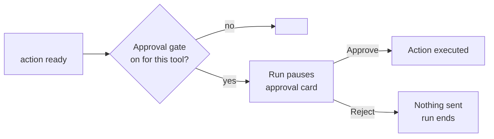

# Security, human control and compliance

> [!info] In one sentence
> The agents research and write on their own inside <workspace>, every agent can only use the few tools on its list, uploaded files are data and never orders, and <what leaves the system> waits for one click of human approval <in production / always>.

## 1. What runs on its own, and what waits for a human

Derive every row from `hitl_mode` and `human_approval_tools` in the configs. In mode `safe`, exactly the listed tools are gated. Do not claim a gate the mode removes.

| Phase | <Outgoing action, for example emails> | Why |
|---|---|---|
| **Pilot** | <recipient, gated or not> | <reason> |
| **Production** | <gated tools, where the approval card appears> | <who decides which actions need a click> |

| Action | Runs on its own? | Why |
|---|---|---|
| Read public sources | Yes | Read-only, public |
| Read files attached to the run | Yes | You gave them to this run |
| Read <data store> and earlier documents | Yes | Read-only, inside the workspace |
| Write rows, create documents in <workspace> | <Yes / gated> | <internal drafts, nothing shared> |
| **<Send / post / external write>** (`<tool>`) | <Pilot: ... Production: waits for approval> | The only action that leaves the workspace |
| <Final business decision> | Never | Not a capability of any pipeline |

Triggered runs (webhooks, events): <state the approval behaviour for triggered runs as enforced by the platform>.

AI assistants connected to Melaya (MCP): <state what the client's assistants were granted, in plain words>. Reading connected services needs the connectors permission. Sending or changing data through a connected service from the chat needs the separate "connectors.write" permission; each such action runs at once and is recorded in the audit log. Anything that moves money or trades (payments, refunds, purchases, transfers, ad budget or bid changes, orders) is refused from any assistant at every permission level and is approved only in the Melaya app.

### The approval card

<Where the card appears and what it shows before anything is sent.>

| Rule written into every mailer | Effect |
|---|---|
| <recipient rule> | <...> |
| "<compose from the previous message only>" | No new claims in the email |
| `<send tool>` exactly once | One message per run |
| A failed tool becomes a short plain note naming the service to reconnect | No raw errors in anyone's inbox |

Pipelines that send or write externally: <list>. Pipelines that do not: <list>.

## 2. Least privilege: each agent has its own short tool list

| Agent | Can | Cannot |
|---|---|---|
| <Agent> (P<n>) | <tools, in plain words> | <what it cannot touch> |

## 3. Quality checks

<The configured loop_policy, in plain words. Observe-only means measured, never rewritten or retried.>

## 4. Untrusted file handling

| Risk | Control |
|---|---|
| A file carries hidden instructions | File text is labelled untrusted data; agents never follow instructions found in a file |
| Malicious files | <verified accepted and refused types, content checks> |
| A run overwriting its inputs | <read-only mount, if true> |
| Files kept forever | <verified retention> |

## 5. Data boundaries

| Data | Where it is | Who sees it |
|---|---|---|
| <Data store>, documents | <account and workspace, pilot vs production> | <...> |
| Messages sent | <...> | <...> |
| Connector scopes | <scopes actually granted, in plain words> | <what Melaya cannot see> |
| Run files | <...> | The run's agents only |
| Text the agents reason over | Sent to <model> at <where the model runs: the provider the client chose, or the client's own model server reached through the runner, so the data never leaves its infrastructure> | Not published |

> [!tip] During the pilot
> <What client data is NOT required, if true.>

## 6. Compliance-relevant behaviours

| Behaviour | Where |
|---|---|
| <verdict rules, for example "clear only if every list was checked"> | [[P<n> <Pipeline>]] |
| A failed or unavailable source is MISSING, never a clean result | <...> |
| Every MISSING and INFERRED item is listed for human validation | <...> |

## 7. What a human always validates

1. <escalations and partial verdicts>
2. Every MISSING and INFERRED field before it enters a decision pack or a formal form.
3. <the recommendation in any draft>
4. <formal documents before filing>
5. <every gated action, via the approval card>

## Related

[[00 Overview]] | [[01 How a Pipeline Works (ELI5)]] | [[02 Run Inputs, Schedules and Triggers]] | [[04 <Data Store> and Provenance]]
