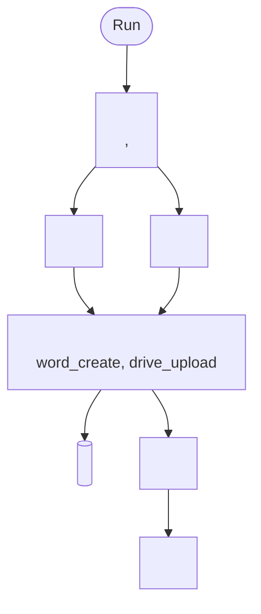

<!--
The 14 sections, in this order, in every pipeline note:
 1 Frontmatter (above)            8  Tools deep dive
 2 In one sentence (callout)      9  Outputs
 3 Business goal + requirements   10 Quality and trust
 4 When to run it and how         11 Human control
 5 Inputs                         12 Example output
 6 Flow diagram                   13 Pilot vs production
 7 Step by step                   14 Related + technical appendix
Fill every value from melaya_pipeline_get. An empty section says "None" and why.
Delete this comment before handover.
-->

# P<n> <Pipeline>

> [!info] In one sentence
> <One ELI5 sentence a non-technical sponsor can repeat: who does what, with which sources, producing what, with what guarantee.>

## 1. Business goal and requirements answered

Goal: <the business outcome, for example "cut X from days to one run, with an audit trail">.

Requirements answered (quoted):
- "<verbatim requirement>"
- "<verbatim requirement>"

## 2. When to run it and how

| Mode | Behaviour |
|---|---|
| Run with inputs | <what the brief should contain> |
| Run now | <default behaviour, exactly as the instructions define it> |
| API / MCP | `brief`<, files, inputs> |
| Schedule / trigger | <cron in plain words and armed or not; trigger source; or None> |

## 3. Inputs

| Name | Required? | Example | If absent |
|---|---|---|---|
| Brief: <field> | <Yes / Recommended / No> | "<example with Acme>" | <fallback behaviour> |
| Files | <...> | <file type> | <...> |
| <Data read automatically> | Read automatically | <...> | <...> |

## 4. Flow diagram

## 5. Step by step

| # | Step / agent | Role (job analogy) | What it does | Tools it calls | Hands to next step |
|---|---|---|---|---|---|
| 1 | <Agent> | <job title> | <plain description> | `<tool>`, `<tool>` | <output contract, for example `TARGET: ...` line> |
| 2a | <Analyst> | <job title> | <...> | `<tool>` | <...> |
| 3 | <Writer> | <job title> | <document built, sections, write-back> | `<tool>` | <...> |
| 4 | <Mailer> | <job title> | <subject pattern, content> | `<tool>` | <recipient> |

## 6. Tools deep dive

| Tool | Why this one | Source | Failure fallback |
|---|---|---|---|
| `<tool>` | <what it adds that others do not> | <named public source or system> | <MISSING / INFERRED / skipped, and when> |

## 7. Outputs

| Artifact | Where it lands | Format | Who sees it |
|---|---|---|---|
| <Document> | <location, name pattern> | <format> | <audience, pilot vs production> |
| <Data store update> | <row> | <fields written> | <...> |

## 8. Quality and trust

| Topic | Detail |
|---|---|
| Provenance | <how each finding is tagged and where the tag appears> |
| Source order | <reliability order used by this pipeline> |
| Code vs model | <what tools compute; what the model assembles and writes> |
| Memory | <data store as memory; persistent_memory setting> |
| Known limits | <honest list, source by source> |

> [!warning] <Limit that most affects trust in this pipeline>
> <What happens and how it is shown to the reader.>

## 9. Human control

- Approvals: <pilot vs production, derived from hitl_mode and human_approval_tools>.
- A human must resolve: <escalations, MISSING items, INFERRED items, final verdict or decision>.

## 10. Example output (<validated run | illustrative>)

> [!success] <Short title of a validated run>
> <Real output, anonymized where third parties are named. A table of Check / Result / Status is ideal.>
>
> | Check | Result | Status |
> |---|---|---|
> | <...> | <...> | <SOURCE / INFERRED / MISSING> |
>
> <One line on what this shows about the system's behaviour.>

<If no validated run exists, use instead:>

> [!example] Illustrative, not a real <entity>
> <Invented output with Acme-style names.>

## 11. Pilot vs production

| Pilot | Production |
|---|---|
| <recipient and approval in pilot> | <approval-gated actions in production> |
| <public or draft sources> | <client systems, paid providers, official templates> |
| <manual run> | <armed schedule or trigger> |

## 12. Related

[[00 Overview]] | [[P<m> <Pipeline>]] | [[03 Tools Catalogue]] | [[06 Security, Human Control and Compliance]]

> [!abstract]- Technical appendix
> Canonical name: `<canonical_pipeline_name>` (display name "<Display name>", project <Project>).
> Steps: `<s1>` <Agent>, `<s2>` parallel (<Analyst 1>, <Analyst 2>; join = <strategy>), `<s3>` <Writer>, `<s4>` <Mailer> (`<send tool>`, <gated or not>). persistent_memory: <true | false>. schedule: <value>.
